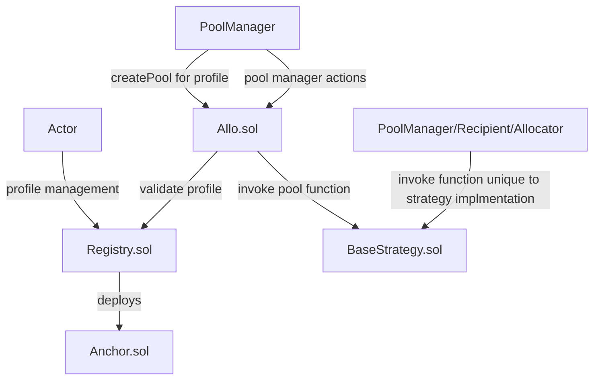

# Allo Protocol

The Allo Protocol introduces a sophisticated ecosystem on the Ethereum blockchain, enabling automated and decentralized fund allocation and distribution. The protocol comprises a set of smart contracts that collectively offer an advanced framework for fund management, fee handling, and governance. The technical architecture and interactions within the protocol are explained below.

## Table of Contents

- [Allo Protocol](#allo-protocol)
  - [Table of Contents](#table-of-contents)
  - [Diagram](#diagram)
  - [Contract Overview](#contract-overview)
    - [Registry Contract (`Registry.sol`)](#registry-contract-registrysol)
    - [Anchor Contract (`Anchor.sol`)](#anchor-contract-anchorsol)
    - [Allo Contract (`Allo.sol`)](#allo-contract-allosol)
  - [Key Functionality and Interactions](#key-functionality-and-interactions)
    - [Profile Creation and Management:](#profile-creation-and-management)
    - [Secure External Interactions:](#secure-external-interactions)
    - [Advanced Fund Allocation and Distribution:](#advanced-fund-allocation-and-distribution)
    - [Fee Handling and Treasury Management:](#fee-handling-and-treasury-management)
  - [Roles and Actors](#roles-and-actors)
  - [Conclusion](#conclusion)
  - [User Flows](#user-flows)
    - [Allo Contract](#allo-contract)
    - [Registry Contract](#registry-contract)
    - [Anchor Contract](#anchor-contract)
    - [Overall Interaction](#overall-interaction)

## Diagram

## Contract Overview

<table>
<thead>
  <tr>
    <th>Contract</th>
    <th>Purpose</th>
  </tr>
</thead>
<tbody>
  <tr>
    <td>Registry.sol</td>
    <td>Registry of profiles which offers profile management</td>
  </tr>
  <tr>
    <td>Anchor.sol</td>
    <td>- Contract which can receive funds / execute transaction. - Generated using identityId and name of the profile - Is linked to a profile in Registry.sol</td>
  </tr>
  <tr>
    <td>Allo.sol</td>
    <td>- Management of a pool - Requires a profile from registry to create a pool - Expects a strategy which implements BaseStrategy.sol - Expects all interactions with the functions on BaseStrategys.sol to happen via Allo.sol</td>
  </tr>
  <tr>
    <td>BaseStrategy.sol</td>
    <td>- Abstract contract which implements IStrategy.sol - Every strategy should override the internal functions to be deemed as a valid strategy  - Can have other functions unique to the strategy which can be invoked directly on the strategy</td>
  </tr>
</tbody>
</table>

### Registry Contract (`Registry.sol`)

The `Registry` contract serves as the foundational building block of the Allo Protocol. It facilitates the creation, attestation, and management of profiles. A profile is a unique entity representing a user's identity within the protocol. This contract offers functions to query profiles by ID and anchor, as well as to create new profiles with personalized metadata, attestation addresses, and members.

Each time a profile generates a new anchor (during profile creation or when profile name is updated), it triggers the deployment of an Anchor Contract. These Anchor Contracts serve as versatile tools that can receive funds or fulfill other designated purposes. This dynamic mechanism enables profiles to engage in a wide array of activities within the protocol, enhancing flexibility and functionality across the Allo ecosystem.

### Anchor Contract (`Anchor.sol`)

The `Anchor` contract is a vital component that enhances the capabilities of profiles. It acts as an isolated enclave, allowing profile owners to securely interact with external addresses. Profile owners can execute calls to target addresses while maintaining control over the amount of native tokens sent and the data transmitted. This contract leverages the `Registry` contract for verifying ownership, ensuring that only authorized users can utilize its functionality.

### Allo Contract (`Allo.sol`)

At the heart of the Allo Protocol lies the `Allo` contract, a versatile and feature-rich smart contract that enables efficient and decentralized fund allocation and distribution. The contract encompasses mechanisms for handling fees, managing treasury, and defining access controls. Its comprehensive design is composed of distinct functions, variables, modifiers, and events that collaboratively enable a robust fund management framework.

## Key Functionality and Interactions

### Profile Creation and Management:

The Allo Protocol commences with the creation and management of profiles through the `Registry` contract. Users can create profiles, each uniquely identified by a profile ID. Profile metadata, attestation addresses, and members can be customized during creation. The `Registry` contract ensures that only authorized users can manipulate profiles by verifying ownership.

### Secure External Interactions:

The `Anchor` contract bridges the gap between profile owners and external addresses. It provides a secure gateway for profile owners to execute calls to external contracts. Profile owners can specify the amount of native tokens and data to be sent along with the call. The `Anchor` contract incorporates the `Registry` contract to validate the ownership of the profile, assuring that only legitimate owners can access its functionalities.

### Advanced Fund Allocation and Distribution:

The crux of the protocol's functionality resides within the `Allo` contract, which enables decentralized and automated fund management. Pools are created and managed within this contract, each with customizable strategies for fund allocation and distribution. Users can create pools, define parameters, and set strategies, while administrators and managers control the actual allocation and distribution of funds.

### Fee Handling and Treasury Management:

The `Allo` contract incorporates a comprehensive fee management system. It allows the contract owner to set and update fee parameters, control treasury addresses, and recover funds. This fee structure ensures the protocol's sustainability and adaptability. The treasury management mechanism enhances the contract's robustness by enabling controlled fund recovery.

## Roles and Actors

The Allo Protocol delegates distinct roles to participants to foster efficient governance:

* **Profile Owners:** Users who create profiles using the `Registry` contract. These profiles are central to protocol interactions, offering a unique identity for users and enabling secure external calls through the `Anchor` contract.
    
* **Allo Owner:** Individuals who control the `Allo` contract, possessing the authority to manage fund recovery, fee parameters, and treasury addresses. Their role is pivotal in ensuring the protocol's financial stability.
  
* **Profile Member:** Members of a Registry profile have specific access rights as defined by the profile's owner.
    
* **Pool Creator** A user who can create new pools using custom or cloneable strategies. They can specify metadata, strategy addresses, managers, and other parameters during pool creation.
    
* **Pool Administrator** Users with administrative control over specific pools. They can manage pool managers, enabling effective pool governance.
    
* **Pool Manager** Users who manage funds within specific pools. They can allocate and distribute funds according to the pool's strategy.
    

## Conclusion

The Allo Protocol is a technologically advanced framework for decentralized fund allocation and distribution. By employing the `Registry`, `Anchor`, and `Allo` contracts in tandem, the protocol establishes an ecosystem where users can securely manage their funds, define strategies, and participate in a DeFi ecosystem that embodies transparency and user-centric governance.

## User Flows

### Allo Contract
    
   * **Functionality:** The `Allo` contract is the central component that manages the creation and operation of pools, strategies, and fund allocation within the Allo ecosystem. It provides functions for creating pools, funding them, allocating funds to recipients, and managing strategies.
   * **Interactions:**
        * The `Allo` contract interacts with the `Registry` contract to manage profiles of users and pool managers. It checks whether an address is authorized to create pools or act as a manager.
        * The `Allo` contract interacts with individual pool strategies (such as contracts that inherit from `BaseStrategy`) to perform allocation and distribution of funds based on specific strategies.
        * It interacts with the `Anchor` contract to execute arbitrary calls to target addresses based on certain conditions.
   * **User Flows:**
        * Users create pools using various strategies, either by providing custom strategies or cloning existing ones.
        * Pools are funded, and the allocated funds are distributed among recipients based on strategy-specific logic.
        * Users can perform batch operations to register and allocate funds to multiple recipients simultaneously.
        * The contract manages the ownership and roles of pool managers and administrators.
        * The contract owner can manage parameters like fee percentages, base fees, and approved strategies.
        * Users can recover funds from the contract.
### Registry Contract
    
   * **Functionality:** The `Registry` contract manages user profiles and their associated permissions in the Allo ecosystem. It defines user profiles, pool managers, and administrators.
   * **Interactions:**
        * The `Registry` contract interacts with the `Allo` contract to validate whether a user or address has the required permissions to create pools or manage them.
   * **User Flows:**
        * Users can create profiles and associate them with addresses to establish roles and permissions.
        * Profiles can define permissions for creating pools, managing pools, and other related tasks.
        * Profiles can have multiple addresses associated with them, allowing for collaboration among users.
        * The `Allo` contract checks with the `Registry` to verify whether a user has the required permissions to perform specific actions.
### Anchor Contract
   * **Functionality:** The `Anchor` contract allows the execution of arbitrary calls to target addresses based on specific conditions.
   * **Interactions:**
        * The `Anchor` contract interacts with the `Allo` contract, allowing authorized users (like pool managers) to initiate calls to external addresses.
   * **User Flows:**
        * Authorized users, such as pool managers, can initiate calls to external target addresses using the `execute` function.
        * The calls can include sending native tokens along with the data to the target address.
        * These calls can be triggered as part of certain conditions or events within the Allo ecosystem.
        * This contract facilitates integration with external systems and smart contracts by allowing dynamic actions based on predefined conditions.

### Overall Interaction

1. Users create profiles in the `Registry` contract and associate their addresses with specific roles and permissions.
2. Users, identified by their addresses and associated profiles, interact with the `Allo` contract to create pools, allocate funds, and manage pools.
3. The `Allo` contract checks user profiles with the `Registry` to ensure that only authorized users perform certain actions.
4. Strategies (inherited from `BaseStrategy`) within the `Allo` contract handle allocation, distribution, and management of funds based on specific logic.
5. The `Anchor` contract allows for dynamic execution of arbitrary calls based on predefined conditions, often triggered by events in the `Allo` ecosystem.
6. Together, these contracts create an ecosystem where users can manage and allocate funds according to various strategies while adhering to predefined permissions and conditions.
