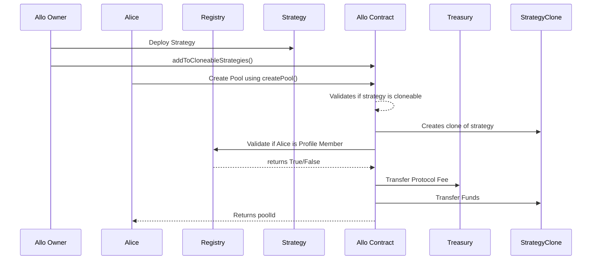
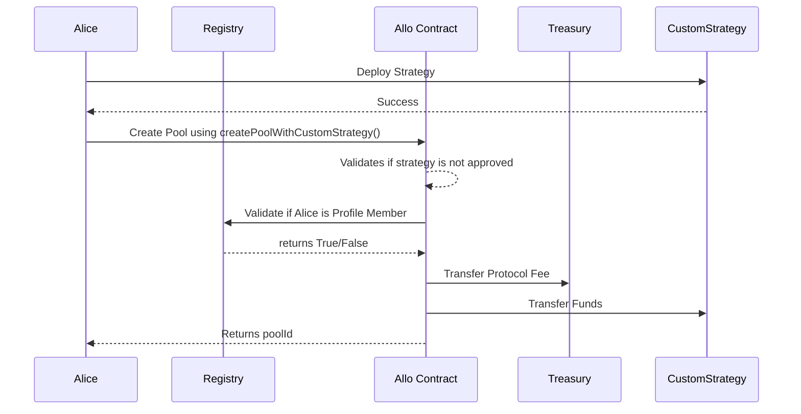
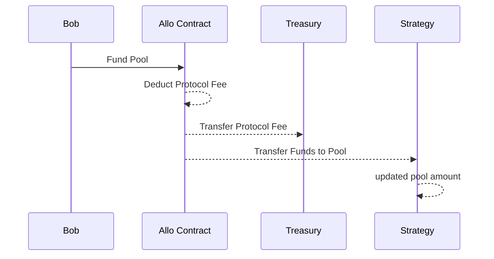
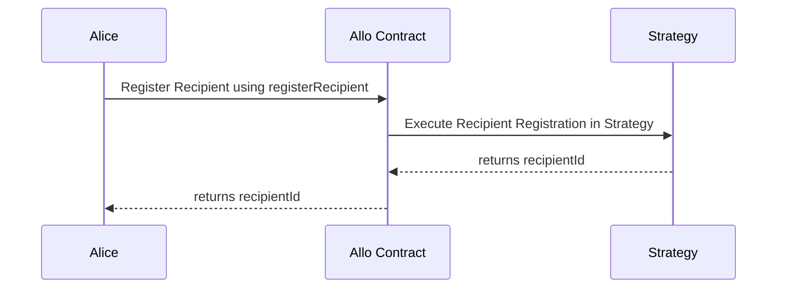
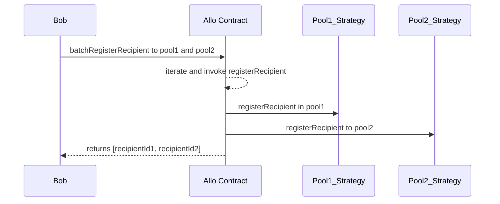
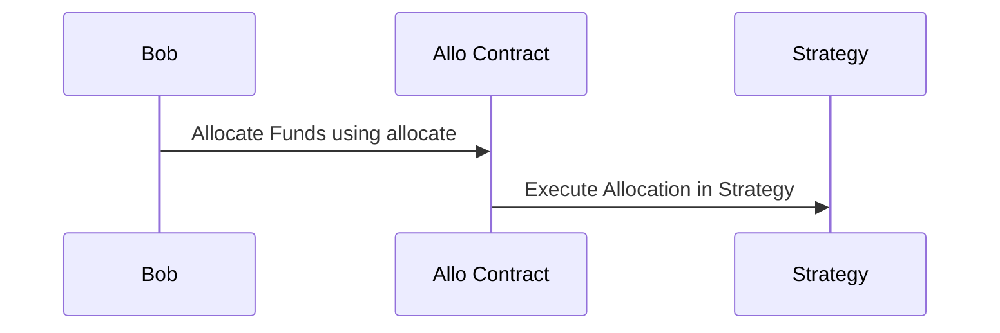
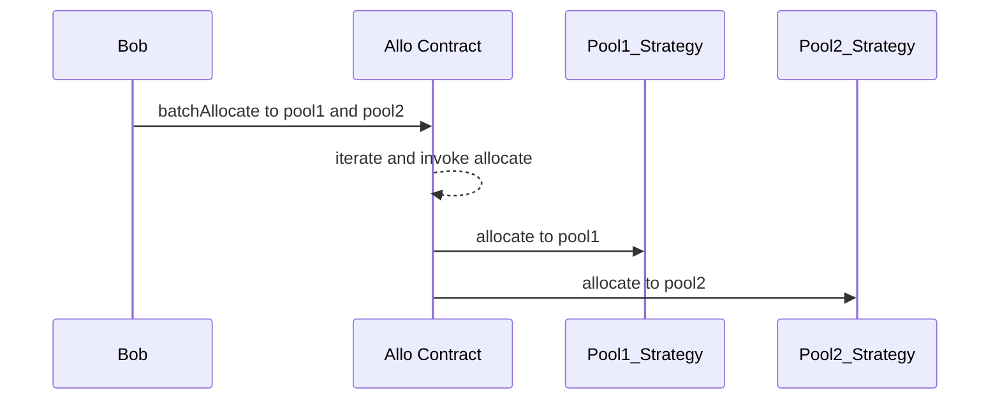
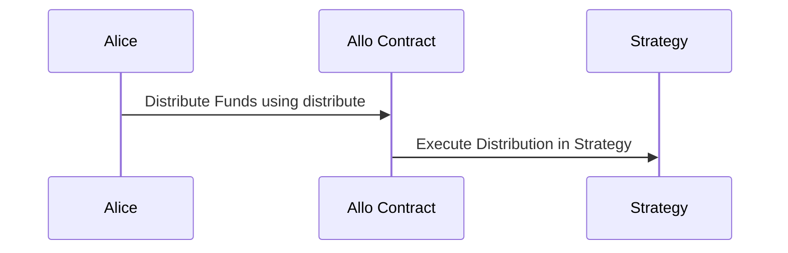

# Allo.sol

The Allo contract serves as a platform to create and manage pools with customizable strategies, allowing for decentralized and automated fund allocation and distribution. The contract includes mechanisms for handling fees, treasury management, and various access controls to ensure proper functioning and security.

## Table of Contents
- [Allo.sol](#allosol)
  - [Table of Contents](#table-of-contents)
  - [Sequence Diagrams](#sequence-diagrams)
    - [Create Pool](#create-pool)
    - [Fund Pool](#fund-pool)
    - [Register Recipient](#register-recipient)
    - [Batch Register Recipient](#batch-register-recipient)
    - [Allocate](#allocate)
    - [Batch Allocate](#batch-allocate)
    - [Distribute](#distribute)
  - [Smart Contract Overview](#smart-contract-overview)
    - [Storage Variables](#storage-variables)
    - [Modifiers](#modifiers)
    - [Functions and Actors](#functions-and-actors)
    - [Actors](#actors)
  - [User Flows](#user-flows)
    - [Initializer](#initializer)
    - [Create a Pool with Custom Strategy](#create-a-pool-with-custom-strategy)
    - [Create a Pool by Cloning a Cloneable Strategy](#create-a-pool-by-cloning-a-cloneable-strategy)
    - [Update Pool Metadata](#update-pool-metadata)
    - [Update Registry Address](#update-registry-address)
    - [Update Treasury Address](#update-treasury-address)
    - [Update Fee Percentage](#update-fee-percentage)
    - [Update Base Fee](#update-base-fee)
    - [Add Strategy to Cloneable Strategies](#add-strategy-to-cloneable-strategies)
    - [Remove Strategy from Cloneable Strategies](#remove-strategy-from-cloneable-strategies)
    - [Add Pool Manager](#add-pool-manager)
    - [Remove Pool Manager](#remove-pool-manager)
    - [Recover Funds](#recover-funds)
    - [Register Recipient](#register-recipient-1)
    - [Batch Register Recipients](#batch-register-recipients)
    - [Fund a Pool](#fund-a-pool)
    - [Allocate Funds to Strategy](#allocate-funds-to-strategy)
    - [Batch Allocate Funds to Strategies](#batch-allocate-funds-to-strategies)
    - [Distribute Funds to Recipients](#distribute-funds-to-recipients)

## Sequence Diagrams

### Create Pool

**Create Pool with Custom Strategy**

### Fund Pool

### Register Recipient

### Batch Register Recipient

### Allocate

### Batch Allocate

### Distribute

## Smart Contract Overview

* **License:** The contract is licensed under the AGPL-3.0-only license.
* **Solidity Version:** The contract is written in Solidity version 0.8.19.
* **Inheritance:** The contract inherits from several other contracts: `Initializable`, `Ownable`, `AccessControl`, `IAllo`, `Native`, and `Transfer`.

### Storage Variables

1. `percentFee` (Private): This variable holds the fee percentage applied to transactions within pools. It's represented as a fraction of 1e18, where 1e18 equals 100%.
2. `baseFee` (Internal): An internal variable storing the base fee for transactions.
3. `_poolIndex` (Private): This variable tracks the incremental index for newly created pools.
4. `treasury` (Payable Address): This is the address where fees are sent and stored.
5. `registry` (Interface): An interface to the registry of pool creators.
6. `_nonces` (Mapping): A mapping from addresses to nonces, used for cloning strategies.
7. `pools` (Mapping): Maps pool IDs to `Pool` struct instances containing pool-specific information.
8. `cloneableStrategies` (Mapping): Maps strategy addresses to a boolean indicating whether they are cloneable.

### Modifiers

* `onlyPoolManager(uint256 _poolId)`: A modifier ensuring that only pool managers of a specific pool can access a function.
* `onlyPoolAdmin(uint256 _poolId)`: A modifier ensuring that only pool administrators of a specific pool can access a function.

### Functions and Actors

1. **Initializer** (`initialize`) This function initializes the contract after deployment or an upgrade. It sets the owner and initializes key contract variables such as the registry address, treasury address, fee parameters, and permissions.
    
2. **Pool Creation Functions** (`createPoolWithCustomStrategy` and `createPool`) These functions allow users to create new pools. The first function creates a pool with a custom strategy, while the second creates a pool by cloning an existing strategy. The provided metadata, strategy details, and other parameters are used to create and configure the new pool.
    
3. **Update Functions** (`updatePoolMetadata`, `updateRegistry`, `updateTreasury`, `updatePercentFee`, `updateBaseFee`, `addToCloneableStrategies`, and `removeFromCloneableStrategies`) These functions allow the contract owner to update various parameters. For example, they can change pool metadata, the registry address, treasury address, fee percentage, base fee, and the list of cloneable strategies.
    
4. **Pool Manager Functions** (`addPoolManager` and `removePoolManager`) These functions allow pool administrators to manage pool managers. Pool managers can perform actions like fund allocation and distribution within their assigned pool.
    
5. **Funds Recovery Function** (`recoverFunds`) This function enables the contract owner to recover funds from the contract. It can be used to retrieve native tokens or ERC20 tokens held in the contract.
    
6. **Strategy Interaction Functions** (`registerRecipient`, `batchRegisterRecipient`, `fundPool`, `allocate`, `batchAllocate`, and `distribute`) These functions interact with pool strategies to manage fund allocation and distribution. Users can register recipients, allocate funds, and distribute funds according to specific strategies.
    
7. **View Functions** (`isPoolAdmin`, `isPoolManager`, `getStrategy`, `getPercentFee`, `getBaseFee`, `getTreasury`, `getRegistry`, `isCloneableStrategy`, and `getPool`) These functions provide information about the contract, pool administrators and managers, strategies, fees, treasury address, and pool details.
    

### Actors

* **Owner** The contract owner has special privileges, including updating contract parameters, managing strategies, and recovering funds. They have ultimate control over the contract's behavior.
    
* **Pool Creator** A user who can create new pools using custom or cloneable strategies. They can specify metadata, strategy addresses, managers, and other parameters during pool creation.
    
* **Pool Administrator** Users with administrative control over specific pools. They can manage pool managers, enabling effective pool governance.
    
* **Pool Manager** Users who manage funds within specific pools. They can allocate and distribute funds according to the pool's strategy.
    
* **Strategy** Smart contracts implementing fund allocation and distribution logic for each pool. Strategies can be custom or cloneable and determine how funds are managed within a pool.
    

In summary, the "Allo" smart contract provides a framework for creating and managing pools with customizable fund allocation and distribution strategies. It leverages access controls, mappings, and functions to enable various actions within the protocol. The contract is designed to support a  ecosystem, enhancing the efficiency and transparency of fund management in Ethereum-based applications.

## User Flows

### Initializer
    
 * The contract has an `initialize` function that initializes the contract after an upgrade.
 * The function takes `_registry`, `_treasury`, `_percentFee`, and `_baseFee` as parameters and sets various contract parameters, such as treasury, registry, percentage fee, and base fee.
 * This function can only be called by the contract owner.
### Create a Pool with Custom Strategy
    
 * Users can create a new pool by calling the `createPoolWithCustomStrategy` function.
 * The function requires the `_profileId`, `_strategy`, `_initStrategyData`, `_token`, `_amount`, `_metadata`, and `_managers` as parameters.
 * The contract checks if the `_strategy` is not a cloneable strategy and then calls the internal `_createPool` function to create the pool.
### Create a Pool by Cloning a Cloneable Strategy
    
 * Users can create a new pool by calling the `createPool` function.
 * The function requires the `_profileId`, `_strategy`, `_initStrategyData`, `_token`, `_amount`, `_metadata`, and `_managers` as parameters.
 * The contract checks if the `_strategy` is a cloneable strategy and then creates a new pool by cloning the strategy using the internal `_createPool` function.
### Update Pool Metadata
    
 * Pool managers can update the metadata of a pool by calling the `updatePoolMetadata` function.
 * The function requires the `_poolId` and `_metadata` as parameters.
 * The contract checks if the caller is a pool manager, then updates the pool's metadata.
  ### Update Registry Address
    
 * The contract owner can update the registry address by calling the `updateRegistry` function.
 * The function requires the new `_registry` address as a parameter, and it updates the registry address accordingly.
### Update Treasury Address
    
 * The contract owner can update the treasury address by calling the `updateTreasury` function.
 * The function requires the new `_treasury` address as a parameter, and it updates the treasury address accordingly.
### Update Fee Percentage
    
 * The contract owner can update the fee percentage by calling the `updatePercentFee` function.
 * The function requires the new `_percentFee` as a parameter, and it updates the fee percentage accordingly.
### Update Base Fee
    
 * The contract owner can update the base fee by calling the `updateBaseFee` function.
 * The function requires the new `_baseFee` as a parameter, and it updates the base fee accordingly.
### Add Strategy to Cloneable Strategies
    
 * The contract owner can add a strategy to the cloneable strategies list by calling the `addToCloneableStrategies` function.
 * The function requires the `_strategy` address as a parameter, and it approves the strategy for cloning.
### Remove Strategy from Cloneable Strategies
    
 * The contract owner can remove a strategy from the cloneable strategies list by calling the `removeFromCloneableStrategies` function.
 * The function requires the `_strategy` address as a parameter, and it removes the strategy from the list.
### Add Pool Manager
    
 * Pool admins can add a pool manager to a pool by calling the `addPoolManager` function.
 * The function requires the `_poolId` and `_manager` address as parameters, and it grants the pool manager role to the address.
### Remove Pool Manager
   
 * Pool admins can remove a pool manager from a pool by calling the `removePoolManager` function.
 * The function requires the `_poolId` and `_manager` address as parameters, and it revokes the pool manager role from the address.
### Recover Funds
    
 * The contract owner can recover funds from the contract by calling the `recoverFunds` function.
 * The function requires the `_token` address and `_recipient` address as parameters.
 * The contract transfers the specified amount of funds (either native or ERC20) to the recipient.
### Register Recipient
    
 * Users can register a recipient by calling the `registerRecipient` function.
 * The function requires the `_poolId` and `_data` as parameters, and it passes the data to the strategy for registration.
### Batch Register Recipients
    
 * Users can register multiple recipients to multiple pools simultaneously by calling the `batchRegisterRecipient` function.
 * The function requires arrays of `_poolIds` and `_data` as parameters, and it registers recipients for each pool.
### Fund a Pool
    
 * Users can fund a pool by calling the `fundPool` function.
 * The function requires the `_poolId` and `_amount` as parameters, and it funds the pool with the specified amount of tokens.
### Allocate Funds to Strategy
    
 * Users can allocate funds to a pool's strategy by calling the `allocate` function.
 * The function requires the `_poolId` and `_data` as parameters, and it passes the data to the strategy for allocation.
### Batch Allocate Funds to Strategies
    
 * Users can allocate funds to strategies of multiple pools by calling the `batchAllocate` function.
 * The function requires arrays of `_poolIds` and `_datas` as parameters, and it allocates funds to strategies for each pool.
### Distribute Funds to Recipients
    
 * Users can distribute funds to recipients using a pool's distribution strategy by calling the `distribute` function.
 * The function requires the `_poolId`, `_recipientIds`, and `_data` as parameters, and it passes the data to the strategy for distribution.