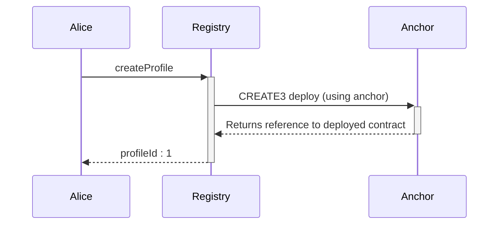
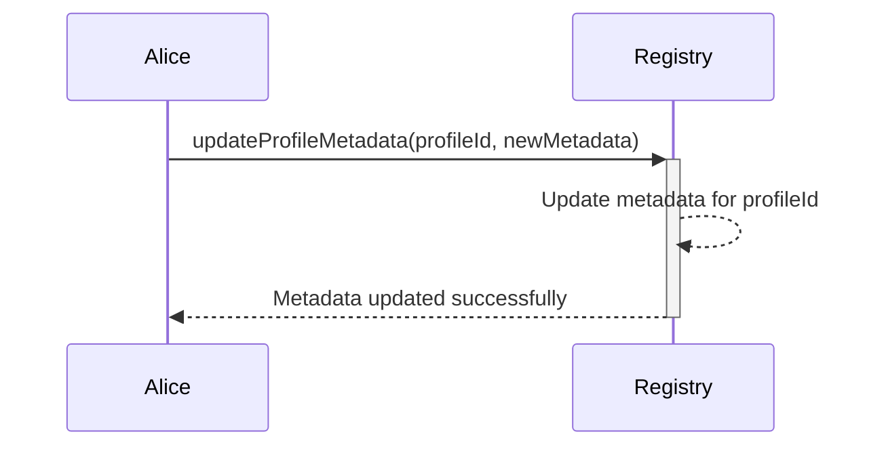
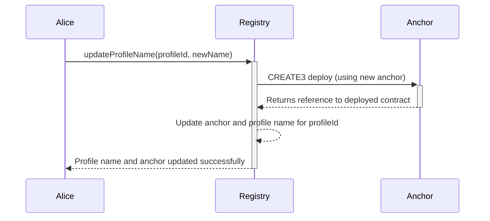
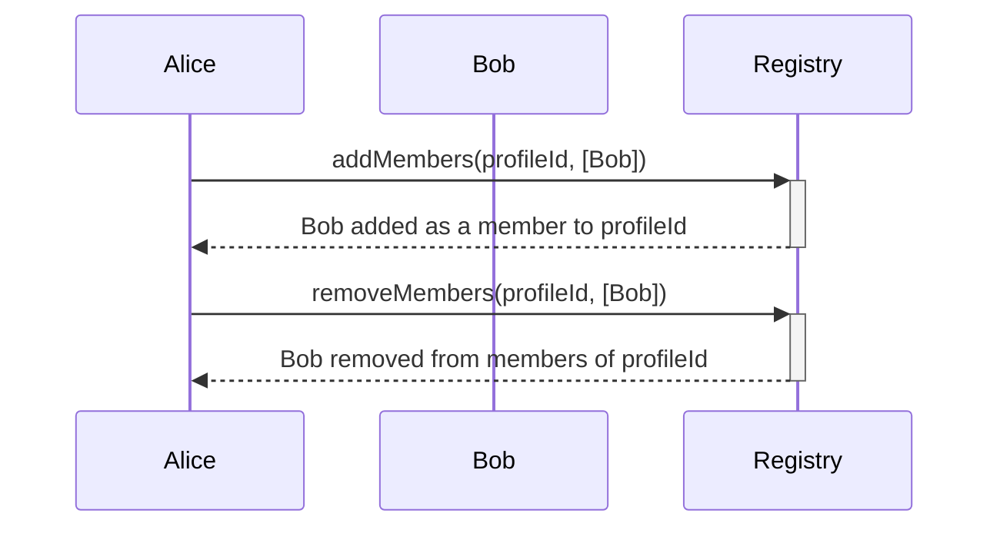
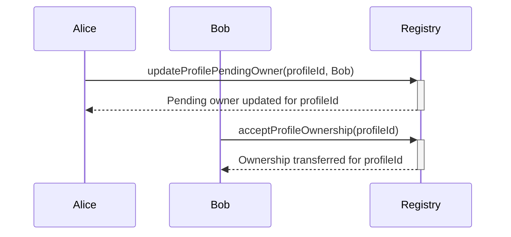

# Registry.sol

The `Registry` contract is a fundamental component of the Allo ecosystem, enabling the creation and management of profiles. Profiles serve as essential entities for decentralized applications, offering identity management, access control, and interaction capabilities. This contract is equipped with mechanisms for creating profiles, updating metadata, managing ownership, and handling fund recovery. It leverages external libraries, interfaces, and internal functions to provide robust functionality while adhering to security and transparency.

## Table of Contents

- [Registry.sol](#registrysol)
  - [Table of Contents](#table-of-contents)
  - [Sequence Diagrams](#sequence-diagrams)
    - [Creating A Profile](#creating-a-profile)
    - [Updates Profile](#updates-profile)
    - [Member Management](#member-management)
    - [Profile Owner Transfer](#profile-owner-transfer)
  - [Smart Contract Overview](#smart-contract-overview)
    - [Storage Variables](#storage-variables)
    - [Modifiers](#modifiers)
    - [Constructor](#constructor)
    - [External/Public Functions](#externalpublic-functions)
    - [Internal Functions](#internal-functions)
    - [Actors](#actors)
  - [User Flows](#user-flows)
    - [Create a Profile](#create-a-profile)
    - [Update Profile Name and Anchor](#update-profile-name-and-anchor)
    - [Update Profile Metadata](#update-profile-metadata)
    - [Add Members to Profile](#add-members-to-profile)
    - [Remove Members from Profile](#remove-members-from-profile)
    - [Update Pending Owner](#update-pending-owner)
    - [Accept Profile Ownership](#accept-profile-ownership)
    - [Retrieve Profile Information](#retrieve-profile-information)
    - [Check Ownership and Membership](#check-ownership-and-membership)
    - [Recover Funds](#recover-funds)

## Sequence Diagrams

### Creating A Profile

### Updates Profile

### Member Management

### Profile Owner Transfer

## Smart Contract Overview

* **License:** The `Registry` contract adheres to the MIT License, promoting permissive open-source usage.
* **Solidity Version:** Developed using Solidity version 0.8.19, harnessing the latest advancements in Ethereum smart contract technology.
* **External Libraries:** The contract incorporates the `AccessControl` and `CREATE3` external libraries, enhancing access control and facilitating contract deployment.
* **Interfaces:** The contract utilizes the `IRegistry` interface for communication with external components.

### Storage Variables

1. `anchorToProfileId` (Public Mapping): This mapping correlates anchor addresses to corresponding profile IDs, providing efficient lookup capabilities.
2. `profilesById` (Public Mapping): A mapping associating profile IDs with instances of the `Profile` struct. This struct encapsulates profile-specific information.
3. `profileIdToPendingOwner` (Public Mapping): This mapping links profile IDs to addresses representing pending owners, enabling controlled ownership transfer.
4. `ALLO_OWNER` (Public Constant): A constant representing the role of the Allo owner for fund recovery.

### Modifiers

* `onlyProfileOwner(bytes32 _profileId)`: A modifier ensuring that only the owner of a specific profile can access a function.

### Constructor

The contract constructor initializes the Allo owner role and assigns the provided initial owner address.

### External/Public Functions

1. **`getProfileById`**: Retrieve profile details using the profile ID.
2. **`getProfileByAnchor`**: Retrieve profile details using the profile's anchor address.
3. **`createProfile`**: Create a new profile, assigning owners and members along with profile-specific attributes.
4. **`updateProfileName`**: Update a profile's name and generate a new anchor.
5. **`updateProfileMetadata`**: Update a profile's metadata, accessible only to the owner.
6. **`isOwnerOrMemberOfProfile`**: Check if an address is either an owner or a member of a profile.
7. **`isOwnerOfProfile`**: Check if an address is the owner of a profile.
8. **`isMemberOfProfile`**: Check if an address is a member of a profile.
9. **`updateProfilePendingOwner`**: Update the pending owner of a profile, restricted to the current owner.
10. **`acceptProfileOwnership`**: Transfer profile ownership to the pending owner, initiated by the pending owner.
11. **`addMembers`**: Add members to a profile, restricted to the profile's owner.
12. **`removeMembers`**: Remove members from a profile, restricted to the profile's owner.

### Internal Functions

1. **`_generateAnchor`**: Generate and deploy an anchor for a given profile ID and name.
2. **`_generateProfileId`**: Generate a profile ID based on the provided nonce and the caller's address.
3. **`_isOwnerOfProfile`**: Check if an address is the owner of a profile.
4. **`_isMemberOfProfile`**: Check if an address is a member of a profile.

### Actors

* **Allo Owner:** The Allo owner possesses the ability to recover funds, perform upgrades, and manage the contract's overarching aspects.
* **Profile Owner:** A user who owns a profile can perform actions such as updating profile attributes, managing members, and transferring ownership.
* **Profile Member:** Members of a profile have specific access rights as defined by the profile's owner.
* **Pending Owner:** The address designated as the pending owner can assume ownership of the profile once the current owner confirms the transfer.

In summary, the `Registry` smart contract provides a comprehensive system for creating and managing profiles within the Allo ecosystem. It offers functionalities such as profile creation, metadata updates, ownership management, and fund recovery. By leveraging a combination of storage variables, modifiers, external functions, and internal functions, the contract contributes to establishing decentralized identity management and access control mechanisms. The `Registry` contract is designed to facilitate the seamless integration of profiles within Ethereum-based decentralized applications, promoting efficiency and security in user interactions and data management.

## User Flows

### Create a Profile   
  * User initiates a transaction to the `createProfile` function with the required parameters: `_nonce`, `_name`, `_metadata`, `_owner`, and `_members`.
  * The contract generates a unique `profileId` based on `_nonce` and the caller's address using the `_generateProfileId` function.
  * The contract creates a new `Profile` object containing the provided data and assigns it to the `profilesById` mapping using the generated `profileId`.
  * Roles are granted to the `_members` of the profile using the `_grantRole` function.
  * The contract emits the `ProfileCreated` event to indicate the successful creation of the profile.
### Update Profile Name and Anchor
    
  * The profile owner initiates a transaction to the `updateProfileName` function with the `_profileId` and the new `_name`.
  * The contract generates a new anchor using `_generateAnchor` function and the `_profileId` and `_name`.
  * The contract updates the anchor mapping to remove the old anchor and assigns the new anchor to the profile.
  * The contract emits the `ProfileNameUpdated` event to indicate the successful update of the profile name and anchor.
### Update Profile Metadata
    
  * The profile owner initiates a transaction to the `updateProfileMetadata` function with the `_profileId` and the new `_metadata`.
  * The contract updates the metadata of the profile identified by `_profileId`.
  * The contract emits the `ProfileMetadataUpdated` event to indicate the successful update of the profile metadata.
### Add Members to Profile
    
  * The profile owner initiates a transaction to the `addMembers` function with the `_profileId` and an array of `_members`.
  * The contract grants roles to the new members using the `_grantRole` function.
  * The contract emits events to indicate the successful addition of members.
### Remove Members from Profile
    
  * The profile owner initiates a transaction to the `removeMembers` function with the `_profileId` and an array of `_members`.
  * The contract revokes roles from the members using the `_revokeRole` function.
  * The contract emits events to indicate the successful removal of members.
### Update Pending Owner
    
  * The profile owner initiates a transaction to the `updateProfilePendingOwner` function with the `_profileId` and the new `_pendingOwner`.
  * The contract updates the pending owner for the profile identified by `_profileId`.
  * The contract emits the `ProfilePendingOwnerUpdated` event to indicate the successful update of the pending owner.
### Accept Profile Ownership
    
  * The pending owner initiates a transaction to the `acceptProfileOwnership` function with the `_profileId`.
  * The contract checks if the caller is the pending owner of the profile.
  * If the caller is the pending owner, the contract updates the owner of the profile and clears the pending owner.
  * The contract emits the `ProfileOwnerUpdated` event to indicate the successful transfer of ownership.
### Retrieve Profile Information
    
  * Users can query profile information using the `getProfileById` and `getProfileByAnchor` functions by providing the `_profileId` or `_anchor`.
### Check Ownership and Membership
    
  * Users can check if an address is the owner or member of a profile using the `isOwnerOrMemberOfProfile`, `isOwnerOfProfile`, and `isMemberOfProfile` functions.
### Recover Funds
    
  * The allo owner (an address with the ALLO_OWNER role) initiates a transaction to the `recoverFunds` function with the `_token` and `_recipient` addresses.
  * The contract transfers the remaining funds from the contract to the recipient.