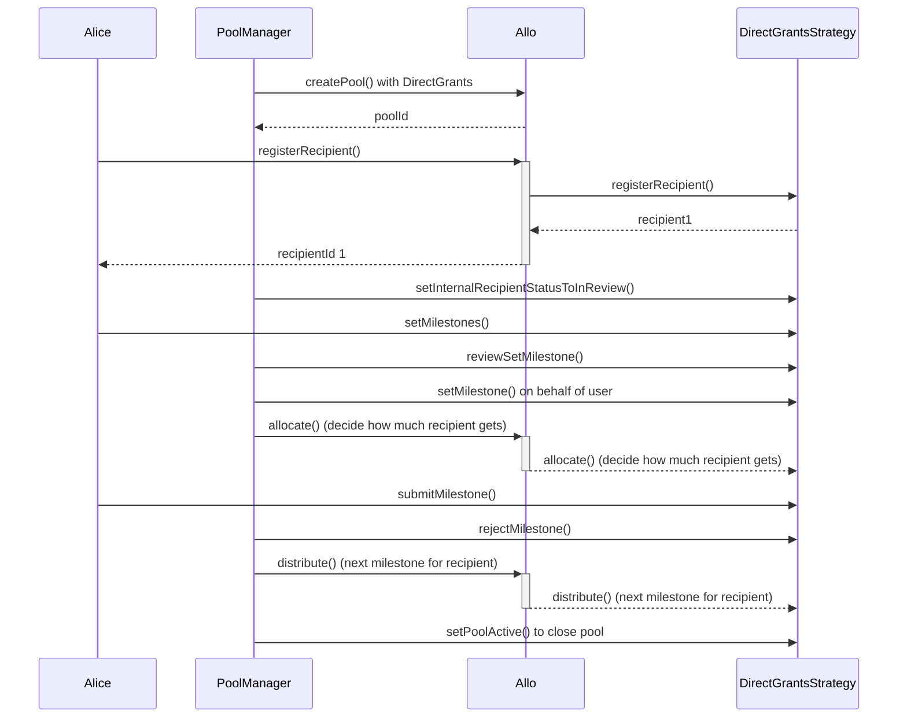

# DirectGrantsSimpleStrategy.sol

The `DirectGrantsSimpleStrategy` contract represents a smart contract governing direct grant allocations to recipients within the Allo ecosystem. It extends the capabilities of the `BaseStrategy` contract and integrates features specifically tailored for managing recipient registration, milestone submissions, and reviews for direct grants. The contract also incorporates the `ReentrancyGuard` library to prevent reentrant attacks.

**Smart Contract Overview:**

* **License:** The `DirectGrantsSimpleStrategy` contract operates under the AGPL-3.0-only License, fostering open-source usage under specific terms.
* **Solidity Version:** Developed using Solidity version 0.8.19, capitalizing on the latest Ethereum smart contract functionalities.
* **External Libraries:** Utilizes the `ReentrancyGuard` library from the OpenZeppelin contracts to prevent reentrant attacks.
* **Interfaces:** Inherits from the `BaseStrategy` contract, extending its functionalities for direct grant allocation strategies.
* **Internal Libraries:** Imports the `Metadata` library from the Allo core for metadata management.

**Enums:**

1. `InternalRecipientStatus`: An internal enumeration representing the status of a recipient within the strategy. Possible values include None, Pending, Accepted, Rejected, and InReview.

**Structs:**

1. `Recipient`: Contains recipient-related data, such as the recipient's address, grant amount, metadata, and status.
2. `Milestone`: Holds details about a milestone, including the amount percentage, metadata, and status.

**Events:**

1. `RecipientStatusChanged`: Emitted when the status of a recipient changes.
2. `MilestoneSubmitted`: Emitted when a milestone is submitted by a recipient.
3. `MilestoneStatusChanged`: Emitted when the status of a milestone changes.
4. `MilestonesSet`: Emitted when milestones are set for a recipient.
5. `MilestonesReviewed`: Emitted when the set milestones are reviewed.

**Storage Variables:**

1. `registryGating`: A flag indicating whether registry gating is enabled (recipients need to be registred on the Registry.sol to be register to the pool).
2. `metadataRequired`: A flag indicating whether metadata is required for recipient registration.
3. `grantAmountRequired`: A flag indicating whether a grant amount can be proposed by recipient during registration.
4. `allocatedGrantAmount`: The total grant amount allocated across recipients by the pool managers.
5. `_registry`: A reference to the Allo registry contract.
6. `_acceptedRecipientIds`: An array storing the IDs of accepted recipients.
7. `_recipients`: A mapping from recipient IDs to recipient data.
8. `milestones`: A mapping from recipient IDs to their associated milestones.
9. `upcomingMilestone`: A mapping from recipient IDs to the index of the next upcoming milestone which is pending payment.
10. `totalMilestones`: A mapping from recipient IDs to the total number of milestones.

**Constructor:**

The constructor initializes the strategy by accepting the address of the `IAllo` contract and a name. The initialization parameters include flags for registry gating, metadata requirements, and grant amount requirements.

**Initialize Function:**

The `initialize` function decodes and initializes parameters passed during strategy creation. It sets the pool active and initializes registry gating, metadata requirements, and grant amount requirements.

**Views and Queries:**

1. `getRecipient`: Retrieves recipient details.
2. `getInternalRecipientStatus`: Retrieves the internal recipient status.
3. `getMilestoneStatus`: Retrieves the status of a milestone for a recipient.
4. `getMilestones`: Retrieves all milestones for a recipient.

**External Functions:**

1. `setMilestones`: Sets milestones for a recipient, can only be called by the recipient or a pool manager.
2. `reviewSetMilestones`: Reviews the set milestones of a recipient, only callable by a pool manager.
3. `submitMilestone`: Allows recipients to submit a milestone.
4. `rejectMilestone`: Allows pool managers to reject a pending milestone.
5. `setInternalRecipientStatusToInReview`: Sets the internal status of recipients to "InReview", callable by a pool manager.
6. `withdraw`: Allows pool managers to withdraw funds from the pool.

**Internal Functions:**

1. `_registerRecipient`: Handles recipient registration, processing the provided data.
2. `_allocate`: Allocates funds to recipients based on provided data.
3. `_distribute`: Distributes upcoming milestone funds to recipients.
4. `_distributeUpcomingMilestone`: Distributes funds for a specific milestone to a recipient.
5. `_isProfileMember`: Checks if an address is a profile owner or member.
6. `_getRecipient`: Retrieves recipient data.
7. `_getPayout`: Returns the payout summary for an accepted recipient.
8. `_setMilestones`: Sets milestones for a recipient.

**Receive Function:**

The `receive` function allows the contract to receive Ether through direct transactions.

In essence, the `DirectGrantsSimpleStrategy` contract extends the functionalities of the `BaseStrategy` contract to handle direct grant allocation strategies. It facilitates recipient registration, milestone submissions, reviews, and fund allocations within the Allo ecosystem.

## User Flows

**User Flow: Registering a Recipient**

1. Recipient or Profile Owner initiates a registration request.
    
2. If `registryGating` is enabled: 
    - a. Submits recipient ID, recipient address, grant amount, and metadata.
    - b. Verifies sender's authorization.
    - c. Validates the provided data. 
    - d. If recipient is already accepted, reverts. 
    - e. Registers recipient as "Pending" with provided details. - f. Emits `Registered` event.
    
3. If `registryGating` is disabled: 
    - a. Submits recipient address, registry anchor (optional), grant amount, and metadata.
    - b. Determines if registry anchor is being used. 
    - c. Verifies sender's authorization.
    - d. Validates the provided data. 
    - e. If recipient is already accepted, reverts. 
    - f. Registers recipient as "Pending" with provided details. - g. Emits `Registered` event.
    

* * *

**User Flow: Setting Milestones**

1. Recipient or Pool Manager initiates a milestone setting request.
2. Verifies if sender is authorized to set milestones for the recipient. (This can be recipient owner or the pool manager)
3. If recipient's status is not "Accepted," reverts.
4. If milestones are already set or milestones review status is "Accepted," reverts.
5. Sets provided milestones for the recipient.
6. If sender is a Pool Manager, sets recipient's milestones review status to "Accepted."
7. Emits `MilestonesSet` event (if milestones were successfully set).
8. Emits `MilestonesReviewed` event (if milestones review status was changed by Pool Manager).

* * *

**User Flow: Reviewing Set Milestones**

1. Pool Manager initiates a milestone review request.
2. Verifies if milestone list for the recipient is not empty.
3. If milestones are already reviewed and accepted, reverts.
4. If review status is "Accepted" or "Rejected," updates recipient's milestones review status.
5. Emits `MilestonesReviewed` event.

* * *

**User Flow: Submitting a Milestone Proof**

1. Recipient initiates a milestone proof submission.
2. Verifies if sender is authorized to submit the proof (recipient or profile member).
3. Checks if milestone is pending for the recipient.
4. Updates milestone's metadata and status to "Pending."
5. Emits `MilestoneSubmitted` event.

* * *

**User Flow: Rejecting a Pending Milestone**

1. Pool Manager initiates a milestone rejection request.
2. Verifies if sender is authorized to reject milestones.
3. Verifies if milestone exists and is not already accepted.
4. Sets milestone's status to "Rejected."
5. Emits `MilestoneStatusChanged` event.

* * *

**User Flow: Allocating Grant Amounts**

1. Pool Manager initiates an allocation request.
2. Decodes recipient ID, internal recipient status, and grant amount from provided data.
3. Verifies if sender is a pool manager.
4. Checks if upcoming milestone is not already set for the recipient.
5. If recipient's status is "Accepted": 
    - a. Allocates grant amount to recipient. 
    - b. Updates allocated grant amount. 
    - c. If allocation exceeds pool amount, reverts. 
    - d. Sets recipient's grant amount and status to "Accepted." 
    - e. Emits `RecipientStatusChanged` event. 
    - f. Emits `Allocated` event.
6. If recipient's status is "Rejected": 
    - a. Sets recipient's status to "Rejected." 
    - b. Emits `RecipientStatusChanged` event.

* * *

**User Flow: Distributing Upcoming Milestone**

1. Pool Manager initiates a distribution request.
2. Verifies if sender is a pool manager.
3. Loops through recipient list: 
    - a. Checks if milestone to be distributed is valid. 
    - b. Checks if milestone is pending for distribution.
    - c. Calculates distribution amount based on grant amount and milestone percentage.
    - d. Deducts amount from pool. 
    - e. Transfers amount to recipient's address. 
    - f. Updates milestone's status to "Accepted." 
    - g. Emits `MilestoneStatusChanged` event. 
    - h. Emits `Distributed` event.

* * *

**User Flow: Withdrawing Funds from Pool**

1. Pool Manager initiates a withdrawal request.
2. Verifies if sender is a pool manager.
3. Deducts specified amount from the pool balance.
4. Transfers the specified amount to the sender's address.

* * *

**User Flow: Setting Internal Recipient Status to InReview**

1. Pool Manager initiates a recipient status change request.
2. Verifies if sender is a pool manager.
3. Loops through provided recipient IDs: a. Sets recipient's internal status to "InReview." b. Emits `RecipientStatusChanged` event.

* * *

**User Flow: Receiving Ether (Fallback Function)**

1. The contract receives Ether from external transactions.
2. Ether is added to the contract's balance.
