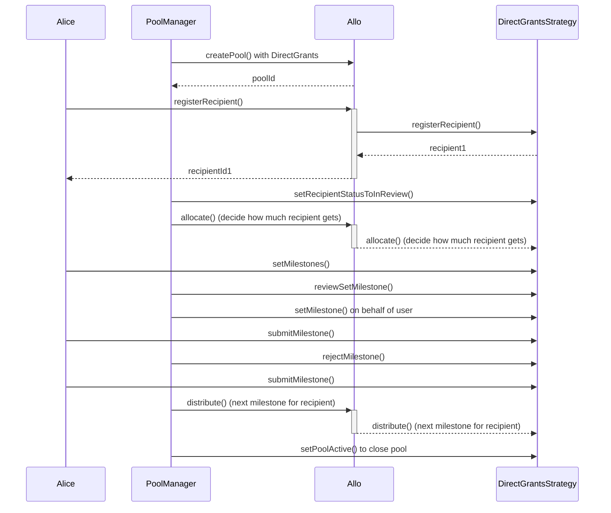

# DirectGrantsSimpleStrategy.sol

The `DirectGrantsSimpleStrategy` contract represents a smart contract governing direct grant allocations to recipients within the Allo ecosystem. It extends the capabilities of the `BaseStrategy` contract and integrates features specifically tailored for managing recipient registration, milestone submissions, and reviews for direct grants. The contract also incorporates the `ReentrancyGuard` library to prevent reentrant attacks.

## Table of Contents

- [DirectGrantsSimpleStrategy.sol](#directgrantssimplestrategysol)
  - [Table of Contents](#table-of-contents)
  - [Sequence Diagram](#sequence-diagram)
  - [Smart Contract Overview](#smart-contract-overview)
    - [Structs](#structs)
    - [Events](#events)
    - [Storage Variables](#storage-variables)
    - [Constructor](#constructor)
    - [Initialize Function](#initialize-function)
    - [Views and Queries](#views-and-queries)
    - [External Functions](#external-functions)
    - [Internal Functions](#internal-functions)
    - [Receive Function](#receive-function)
  - [User Flows](#user-flows)
    - [Registering a Recipient](#registering-a-recipient)
    - [Setting Milestones](#setting-milestones)
    - [Reviewing Set Milestones](#reviewing-set-milestones)
    - [Submitting a Milestone Proof](#submitting-a-milestone-proof)
    - [Rejecting a Pending Milestone](#rejecting-a-pending-milestone)
    - [Allocating Grant Amounts](#allocating-grant-amounts)
    - [Distributing Upcoming Milestone](#distributing-upcoming-milestone)
    - [Withdrawing Funds from Pool](#withdrawing-funds-from-pool)
    - [Setting Recipient Status to InReview](#setting-recipient-status-to-inreview)
    - [Receiving Ether (Fallback Function)](#receiving-ether-fallback-function)

## Sequence Diagram 

## Smart Contract Overview

- **License:** The `DirectGrantsSimpleStrategy` contract operates under the AGPL-3.0-only License, fostering open-source usage under specific terms.
- **Solidity Version:** Developed using Solidity version 0.8.19, capitalizing on the latest Ethereum smart contract functionalities.
- **External Libraries:** Utilizes the `ReentrancyGuard` library from the OpenZeppelin contracts to prevent reentrant attacks.
- **Interfaces:** Inherits from the `BaseStrategy` contract, extending its functionalities for direct grant allocation strategies.
- **Internal Libraries:** Imports the `Metadata` library from the Allo core for metadata management.

### Structs

1. `Recipient`: Contains recipient-related data, such as the recipient's address, grant amount, metadata, and status.
2. `Milestone`: Holds details about a milestone, including the amount percentage, metadata, and status.

### Events

1. `RecipientStatusChanged`: Emitted when the status of a recipient changes.
2. `MilestoneSubmitted`: Emitted when a milestone is submitted by a recipient.
3. `MilestoneStatusChanged`: Emitted when the status of a milestone changes.
4. `MilestonesSet`: Emitted when milestones are set for a recipient.
5. `MilestonesReviewed`: Emitted when the set milestones are reviewed.

### Storage Variables

1. `registryGating`: A flag indicating whether registry gating is enabled (recipients need to be registered on the Registry.sol to be register to the pool).
2. `metadataRequired`: A flag indicating whether metadata is required for recipient registration.
3. `grantAmountRequired`: A flag indicating whether a grant amount can be proposed by recipient during registration.
4. `allocatedGrantAmount`: The total grant amount allocated across recipients by the pool managers.
5. `_registry`: A reference to the Allo registry contract.
6. `_acceptedRecipientIds`: An array storing the IDs of accepted recipients.
7. `_recipients`: A mapping from recipient IDs to recipient data.
8. `milestones`: A mapping from recipient IDs to their associated milestones.
9. `upcomingMilestone`: A mapping from recipient IDs to the index of the next upcoming milestone which is pending payment.
10. `totalMilestones`: A mapping from recipient IDs to the total number of milestones.

### Constructor

The constructor initializes the strategy by accepting the address of the `IAllo` contract and a name. The initialization parameters include flags for registry gating, metadata requirements, and grant amount requirements.

### Initialize Function

The `initialize` function decodes and initializes parameters passed during strategy creation. It sets the pool active and initializes registry gating, metadata requirements, and grant amount requirements.

### Views and Queries

1. `getRecipient`: Retrieves recipient details.
2. `getRecipientStatus`: Retrieves the recipient status.
3. `getMilestoneStatus`: Retrieves the status of a milestone for a recipient.
4. `getMilestones`: Retrieves all milestones for a recipient.

### External Functions

1. `setMilestones`: Sets milestones for a recipient, can only be called by the recipient or a pool manager.
2. `reviewSetMilestones`: Reviews the set milestones of a recipient, only callable by a pool manager.
3. `submitMilestone`: Allows recipients to submit a milestone.
4. `rejectMilestone`: Allows pool managers to reject a pending milestone.
5. `setRecipientStatusToInReview`: Sets the status of recipients to "InReview", callable by a pool manager.
6. `withdraw`: Allows pool managers to withdraw funds from the pool.

### Internal Functions

1. `_registerRecipient`: Handles recipient registration, processing the provided data.
2. `_allocate`: Allocates funds to recipients based on provided data.
3. `_distribute`: Distributes upcoming milestone funds to recipients.
4. `_distributeUpcomingMilestone`: Distributes funds for a specific milestone to a recipient.
5. `_isProfileMember`: Checks if an address is a profile owner or member.
6. `_getRecipient`: Retrieves recipient data.
7. `_getPayout`: Returns the payout summary for an accepted recipient.
8. `_setMilestones`: Sets milestones for a recipient.

### Receive Function

The `receive` function allows the contract to receive Ether through direct transactions.

In essence, the `DirectGrantsSimpleStrategy` contract extends the functionalities of the `BaseStrategy` contract to handle direct grant allocation strategies. It facilitates recipient registration, milestone submissions, reviews, and fund allocations within the Allo ecosystem.

## User Flows

### Registering a Recipient

* Recipient or Profile Owner initiates a registration request.
* If `registryGating` is enabled:
  * Submits recipient ID, recipient address, grant amount, and metadata.
  * Verifies sender's authorization.
  * Validates the provided data.
  * If recipient is already accepted, reverts.
  * Registers recipient as "Pending" with provided details. 
  * Emits `Registered` event.
*  If `registryGating` is disabled:
   *  Submits recipient address, registry anchor (optional), grant amount, and metadata.
   *  Determines if registry anchor is being used.
   *  Verifies sender's authorization.
   *  Validates the provided data.
   *  If recipient is already accepted, reverts.
   *  Registers recipient as "Pending" with provided details. 
   *  Emits `Registered` event.

### Setting Milestones

* Recipient or Pool Manager initiates a milestone setting request.
* Verifies if sender is authorized to set milestones for the recipient. (This can be recipient owner or the pool manager)
* If recipient's status is not "Accepted," reverts.
* If milestones are already set or milestones review status is "Accepted," reverts.
* Sets provided milestones for the recipient.
* If sender is a Pool Manager, sets recipient's milestones review status to "Accepted."
* Emits `MilestonesSet` event (if milestones were successfully set).
* Emits `MilestonesReviewed` event (if milestones review status was changed by Pool Manager).

### Reviewing Set Milestones

* Pool Manager initiates a milestone review request.
* Verifies if milestone list for the recipient is not empty.
* If milestones are already reviewed and accepted, reverts.
* If review status is "Accepted" or "Rejected," updates recipient's milestones review status.
* Emits `MilestonesReviewed` event.

### Submitting a Milestone Proof

* Recipient initiates a milestone proof submission.
* Verifies if sender is authorized to submit the proof (recipient or profile member).
* Checks if milestone is pending for the recipient.
* Updates milestone's metadata and status to "Pending."
* Emits `MilestoneSubmitted` event.

### Rejecting a Pending Milestone

* Pool Manager initiates a milestone rejection request.
* Verifies if sender is authorized to reject milestones.
* Verifies if milestone exists and is not already accepted.
* Sets milestone's status to "Rejected."
* Emits `MilestoneStatusChanged` event.

### Allocating Grant Amounts

* Pool Manager initiates an allocation request.
* Decodes recipient ID, recipient status, and grant amount from provided data.
* Verifies if sender is a pool manager.
* Checks if upcoming milestone is not already set for the recipient.
* If recipient's status is "Accepted":
  * Allocates grant amount to recipient.
  * Updates allocated grant amount.
  * If allocation exceeds pool amount, reverts.
  * Sets recipient's grant amount and status to "Accepted".
  * Emits `RecipientStatusChanged` event.
  * Emits `Allocated` event.
 * If recipient's status is "Rejected":
   * Sets recipient's status to "Rejected".
   * Emits `RecipientStatusChanged` event.

### Distributing Upcoming Milestone

* Pool Manager initiates a distribution request.
* Verifies if sender is a pool manager.
* Loops through recipient list:
  * Checks if milestone to be distributed is valid.
  * Checks if milestone is pending for distribution.
  * Calculates distribution amount based on grant amount and milestone percentage.
  * Deducts amount from pool.
  * Transfers amount to recipient's address.
  * Updates milestone's status to "Accepted."
  * Emits `MilestoneStatusChanged` event.
  * Emits `Distributed` event.

### Withdrawing Funds from Pool

* Pool Manager initiates a withdrawal request.
* Verifies if sender is a pool manager.
* Deducts specified amount from the pool balance.
* Transfers the specified amount to the sender's address.

### Setting Recipient Status to InReview

*  Pool Manager initiates a recipient status change request.
*  Verifies if sender is a pool manager.
*  Loops through provided recipient IDs: 
   *  Sets recipient's status to "InReview." 
   *  Emits `RecipientStatusChanged` event.

### Receiving Ether (Fallback Function)

* The contract receives Ether from external transactions.
* Ether is added to the contract's balance.
