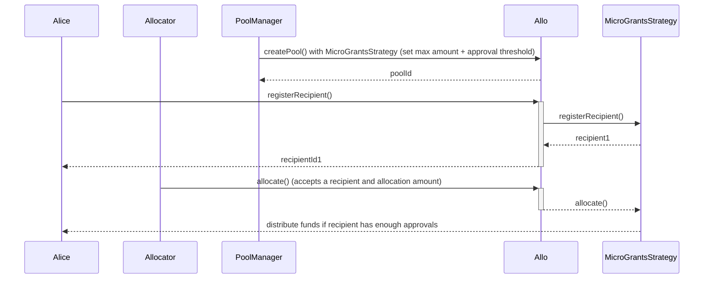
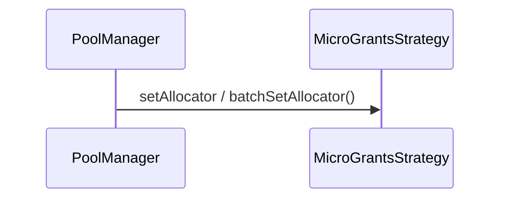

# MicroGrantsStrategy 

The `MicroGrantsStrategy` contract is a Solidity smart contract that implements a strategy for managing micro grants. It is designed to work with the `Allo` contract and extends the functionality of the `BaseStrategy` contract. The strategy involves allocating funds to recipients based on certain criteria and voting by allocators.

They are 3 different versions of the MicroGrants implementation.
- `MicroGrantsStrategy.sol`: uses a whitelist of allocators to determine if an allocator is valid or not.
- `MicroGrantsHatsStrategy.sol`: utilizes Hats protocol for the allocator eligibility.
- `MicroGrantsGovStrategy.sol`: validates an allocator based on the governance token balance at a pre-defined timestamp or block number. It supports both token with `getPriorVotes(sender, blocknumber)` and `getPastVotes(sender, timestamp)`.

## Table of Contents

- [MicroGrantsStrategy](#micrograntsstrategy)
  - [Table of Contents](#table-of-contents)
  - [Sequence Diagram](#sequence-diagram)
  - [Smart Contract Overview](#smart-contract-overview)
    - [Structs](#structs)
    - [Errors](#errors)
    - [Events](#events)
    - [Storage Variables](#storage-variables)
    - [Modifiers](#modifiers)
    - [Constructor](#constructor)
    - [Initialize Function](#initialize-function)
    - [Views](#views)
    - [External/Custom Functions](#externalcustom-functions)
    - [Internal Functions](#internal-functions)
  - [User Flows](#user-flows)
    - [Setting Allocators](#setting-allocators)
    - [Registering a Recipient](#registering-a-recipient)
    - [Allocating to a Recipient](#allocating-to-a-recipient)
    - [Withdrawing Funds from Pool](#withdrawing-funds-from-pool)

## Sequence Diagram 

Only in `MicroGrantsStrategy.sol`:

## Smart Contract Overview

- **License:** The `RFPSimpleStrategy` contract operates under the AGPL-3.0-only License, fostering open-source usage under specific terms.
- **Solidity Version:** Developed using Solidity version 0.8.19, capitalizing on the latest Ethereum smart contract functionalities.
- **External Libraries:** Utilizes the `ReentrancyGuard` library from the OpenZeppelin contracts to prevent reentrant attacks.
- **Interfaces:** Imports interfaces from the Allo core and external libraries.
- **Internal Libraries:** Imports the `Metadata` library from the Allo core for metadata management.

### Structs

- `Recipient`
    - `useRegistryAnchor`: A boolean flag indicating whether to use a registry anchor for the recipient.
    - `recipientAddress`: The address of the recipient.
    - `requestedAmount`: The amount requested by the recipient.
    - `recipientStatus`: The status of the recipient (Pending, Accepted, Rejected).
    - `metadata`: Additional metadata associated with the recipient.

- `InitializeParams`
    - `useRegistryAnchor`: A boolean flag indicating whether to use a registry anchor for initialization.
    - `allocationStartTime`: The start time for the allocation.
    - `allocationEndTime`: The end time for the allocation.
    - `approvalThreshold`: The approval threshold for a recipient to be accepted.
    - `maxRequestedAmount`: The maximum amount that can be requested by a recipient.

### Errors

- `AMOUNT_TOO_LOW`: Thrown when the pool manager attempts to lower the requested amount.
- `EXCEEDING_MAX_AMOUNT`: Thrown when the pool manager attempts to increase the requested amount.

### Events

- `AllocatorSet`: Emitted when an allocator is added.
- `MaxRequestedAmountIncreased`: Emitted when the max requested amount is increased.
- `ApprovalThresholdUpdated`: Emitted when the approval threshold is updated.
- `TimestampsUpdated`: Emitted when the allocation start and end timestamps are updated.
- `UpdatedRegistration`: Emitted when a recipient updates their registration.
- `Allocated`: Emitted when an allocation is made.

### Storage Variables

- **`bool public useRegistryAnchor`**: Flag indicating whether to use the registry anchor.
- **`IRegistry private _registry`**: Interface to the registry contract.
- **`uint64 public allocationStartTime` and `uint64 public allocationEndTime`**: Timestamps in milliseconds for the allocation start and end times.
- **`uint256 public maxRequestedAmount`**: The maximum amount that can be requested by a recipient.
- **`uint256 public approvalThreshold`**: The approval threshold for a recipient to be accepted.
- **`mapping(address => Recipient) internal _recipients`**: Mapping to store recipient details using the recipient's address as the key.
- **`mapping(address => bool) public allocators`**: Mapping to track whether an address is an allocator.
- **`mapping(address => mapping(address => bool)) public allocated`**: Mapping to track if an allocator has voted/allocated to a recipient.
- **`mapping(address => mapping(Status => uint256)) public recipientAllocations`**: Mapping to track the number of votes/allocations for each recipient and status.

### Modifiers

- `onlyActiveAllocation`: A modifier to check if the allocation is active.

### Constructor

The constructor initializes the `MicroGrantsStrategy` contract by setting the `Allo` contract address and the strategy name.

### Initialize Function

The `initialize` function initializes the strategy with specific parameters, including timestamps, approval threshold, and max requested amount.

Depending on the MicroGrants strategy, you also need to pass:
- `MicroGrantsHatsStrategy.sol`: Hats address and HatId
- `MicroGrantsGovStrategy.sol`: Gov token address, block number or time stamp and token amount threshold

### Views

- `getRecipient`: Retrieves information about a specific recipient.
- `_getRecipientStatus`: Internal view function to get the status of a recipient.
- `_getPayout`: Internal view function to get the payout summary for an accepted recipient.

### External/Custom Functions

- `increaseMaxRequestedAmount`: Allows the pool manager to increase the max requested amount.
- `setApprovalThreshold`: Allows the pool manager to set the approval threshold.
- `updatePoolTimestamps`: Allows the pool manager to update allocation start and end timestamps.
- `withdraw`: Allows the pool manager to withdraw tokens from the pool.
  
Function specific to `MicroGrantsStrategy.sol`:

- `batchSetAllocator`: Allows the pool manager to batch set allocator addresses.
- `setAllocator`: Allows the pool manager to set an allocator address.

### Internal Functions

- `_checkOnlyActiveAllocation`: Internal function to check if the allocation is active.
- `_updatePoolTimestamps`: Internal function to update allocation start and end timestamps.
- `_isPoolTimestampValid`: Internal function to check if timestamps are valid.
- `_increaseMaxRequestedAmount`: Internal function to increase the max requested amount.
- `_setApprovalThreshold`: Internal function to set the approval threshold.
- `_isPoolActive`: Internal view function to check if the pool is active.
- `_registerRecipient`: Internal function to register a recipient.
- `_allocate`: Internal function to allocate votes to a recipient.
- `_distribute`: Internal function (not implemented).

## User Flows

### Setting Allocators

Only in `MicroGrantsStrategy.sol`:

* Pool Managers can use `batchSetAllocators` to update list of addresses who are allowed to allocate

### Registering a Recipient

* Recipient or Profile Owner initiates a registration request.
* If `useRegistryAnchor` is enabled:
  * Submits recipient ID, requested amount, and metadata.
  * Verifies sender's authorization.
  * Validates the provided data.
  * Registers recipient as "Pending" with provided details.
  * Emits `Registered` event.
* If `useRegistryAnchor` is disabled:
  * Submits recipient address, registry anchor, proposal bid, and metadata.
  * Determines if the registry anchor is being used.
  * Verifies sender's authorization.
  * Validates the provided data.
  * Registers recipient as "Pending" with provided details.
  * Emits `Registered` event.
* If recipient is re-registring, the `UpdatedRegistration` event is emitted

### Allocating to a Recipient 

* Valid Allocator initiates a allocation request
* An allocator can vote only once for a recipientId
* An allocator can choose to: accept/reject a recipient
    * If the allocator accepts the recipient, we check to see if the recipient has approvals which are equal to the approvalThreshold, then the funds are distributed to the recipient

### Withdrawing Funds from Pool

* Pool Manager initiates a withdrawal request.
* Verifies if sender is authorized to withdraw funds.
* Checks if the pool is inactive.
* Decreases the pool amount by the requested withdrawal amount.
* Transfers the requested amount to the sender.