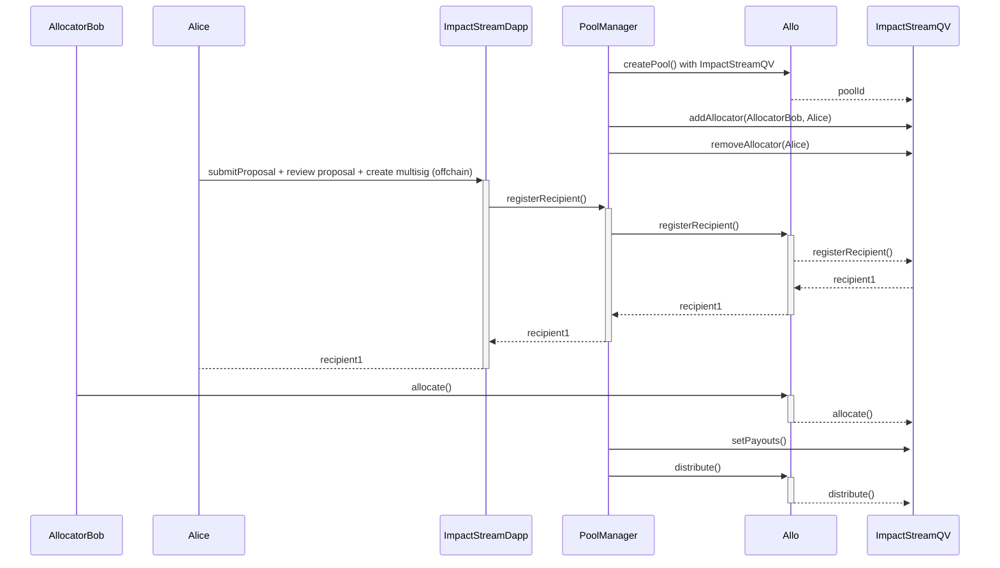

# QVImpactStreamStrategy.sol

The `QVImpactStreamStrategy` is a Solidity smart contract that extends the `QVBaseStrategy` contract and provides functionality for managing allocators, allocating votes, and distributing payouts in a custom strategy.

## Sequence Diagram

## Contract Overview

* **License:** The `QVSimpleStrategy` contract adheres to the AGPL-3.0-only License, promoting open-source usage with specific terms.
* **Solidity Version:** Developed using Solidity version 0.8.22, leveraging the latest Ethereum smart contract advancements.
* **Inheritance:** Inherits from the `QVBaseStrategy` contract, inheriting and expanding core strategy functionalities.

### InitializeParamsSimple

* `maxVoiceCreditsPerAllocator` (uint256): Maximum voice credits that can be allocated by a single allocator.
* `useRegistryAnchor` (bool): Flag to indicate whether to use the registry anchor or not.
* `params` (InitializeParams): Parameters for initializing the strategy (inherited from `QVBaseStrategy`).

## Events

* `AllocatorAdded(address indexed allocator, address sender)`: Emitted when an allocator is added to the strategy.
* `AllocatorRemoved(address indexed allocator, address sender)`: Emitted when an allocator is removed from the strategy.
* `UpdatedRecipientRegistration(address indexed recipientId, bytes data, address sender);`: Emitted when a recipient updates their registration.
* `PayoutSet(Payout[] payouts, address sender)`: Emitted when the payouts are set.

## Storage

* `bool public useRegistryAnchor`: Flag to indicate whether to use the registry anchor or not.
* `uint256 public maxVoiceCreditsPerAllocator`: The maximum voice credits that can be allocated by a single allocator.
* `mapping(address => bool) public allowedAllocators`: Mapping of allocator addresses to their allowed status (true/false).
* `mapping(address => uint256) public payouts`: Payouts to distribute.
* `mapping(address => uint256) public proposalBids`: The proposal bid of the recipient.
* `bool public payoutSet`: A flag indicating whether payouts have been set.

## Structs

### InitializeParamsSimple

* `maxVoiceCreditsPerAllocator` (uint256): Maximum voice credits that can be allocated by a single allocator.
* `useRegistryAnchor` (bool): Flag to indicate whether to use the registry anchor or not.
* `params` (InitializeParams): Parameters for initializing the strategy (inherited from `QVBaseStrategy`).

### Payout

* `address recipientId`: ID of the recipient.
* `uint256 amount`: Amount to be paid.

## Constructor

* `constructor(address _allo, string memory _name)`: Constructor for initializing the contract.

## Initialize

* `initialize(uint256 _poolId, bytes memory _data) external virtual override`: Initialize the strategy with provided parameters, including:

* `uint64 allocationStartTime`: The start time for the allocation.
* `uint64 allocationEndTime`: The end time for the allocation.
* `uint256 maxVoiceCreditsPerAllocator`: Maximum voice credits per allocator.
* `useRegistryAnchor` (bool): Flag to indicate whether to use the registry anchor or not.

## External/Public Functions

* `batchAddAllocator(address[] memory _allocators) external onlyPoolManager(msg.sender)`: Add allocator array.
* `addAllocator(address _allocator) external onlyPoolManager(msg.sender)`: Add allocator.
* `batchRemoveAllocator(address[] memory _allocators) external onlyPoolManager(msg.sender)`: Remove allocator array.
* `removeAllocator(address _allocator) external onlyPoolManager(msg.sender)`: Remove allocator.
* `setPayouts(Payout[] memory _payouts) external onlyPoolManager(msg.sender) onlyAfterAllocation`: Set the payouts to distribute.
* `recoverFunds(address _token, address _recipient) external onlyPoolManager(msg.sender)`: Transfer the funds recovered to the recipient.

## Internal Functions

* `_distribute(address[] memory _recipientIds, bytes memory, address _sender) internal virtual override onlyAfterAllocation`: Distribute funds to recipients.
* `_addAllocator(address _allocator) internal`: Add allocator.
* `_removeAllocator(address _allocator) internal`: Remove allocator.
* `_allocate(bytes memory _data, address _sender) internal virtual override onlyActiveAllocation`: Allocate votes to a recipient.
* `_registerRecipient(bytes memory _data, address _sender) internal virtual override onlyPoolManager(_sender) returns (address recipientId)`: Register a recipient.
* `_isAcceptedRecipient(address _recipientId) internal view returns (bool)`: Check if a recipient is accepted.
* `_isValidAllocator(address _allocator) internal view override returns (bool)`: Check if an allocator is valid.
* `_hasVoiceCreditsLeft(uint256 _voiceCreditsToAllocate, uint256 _allocatedVoiceCredits) internal view returns (bool)`: Check if an allocator has voice credits left.
* `_getRecipient(address _recipientId) internal view returns (Recipient memory)`: Get recipient details.
* `_getRecipientStatus(address _recipientId) internal view virtual override returns (Status)`: Get recipient status.
* `_isPoolActive() internal view virtual override returns (bool)`: Check if a pool is active.
* `_getPayout(address _recipientId, bytes memory) internal view virtual override returns (PayoutSummary memory)`: Get the payout for a single recipient.

## View Functions

* `getVoiceCreditsCastByAllocator(address _allocator) external view returns (uint256)`: Get the voice credits already cast by an allocator.
* `getVoiceCreditsCastByAllocatorToRecipient(address _allocator, address _recipientId) external view returns (uint256)`: Get voice credits cast by an allocator to a recipient.
* `getVotesCastByAllocatorToRecipient(address _allocator, address _recipientId) external view returns (uint256)`: Get votes cast by an allocator to a recipient.
* `getTotalVotesForRecipient(address _recipientId) external view returns (uint256)`: Get the total votes received for a recipient

## User Flows 

### Setting Pool Timestamps

1. **User (Pool Manager)**: Call the `updatePoolTimestamps` function to set the start and end times for the allocation.

### Adding Allocators

1. **User (Pool Manager)**: Call the `addAllocator` function to add a single allocator to the strategy.
2. **User (Pool Manager)**: Alternatively, call the `batchAddAllocator` function to add multiple allocators at once.

### Removing Allocators

1. **User (Pool Manager)**: Call the `removeAllocator` function to remove a single allocator from the strategy.
2. **User (Pool Manager)**: Alternatively, call the `batchRemoveAllocator` function to remove multiple allocators at once.

## User Flow 4: Allocating Votes

1. **User (Allocator)**: Allocate votes to a specific recipient by calling the `allocate` function. The allocator must have voice credits left, and the allocation must be active.

### Updating Recipient Registration

1. **User (Pool Manager)**: Update a recipient's registration information by calling the `registerRecipient` function.

## User Flow 6: Distributing Payouts

1. **User (Pool Manager)**: After the allocation period ends, call the `setPayouts` function to set the payouts for distribution.
2. **User (Pool Manager)**: The pool manager can also recover funds by calling the `recoverFunds` function, which transfers recovered funds to a specified recipient.
