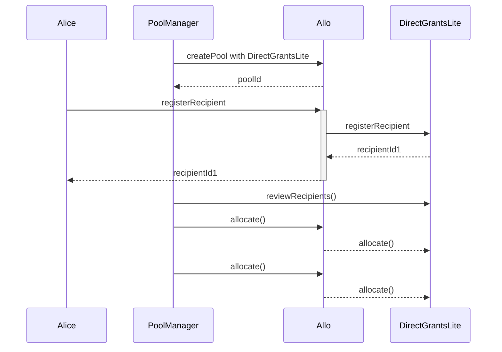

# DirectGrantsLiteStrategy.sol

The cloneable `DirectGrantsLiteStrategy` contract represents a smart contract governing direct grant allocations to recipients within the Allo ecosystem. It extends the capabilities of the `BaseStrategy` contract and integrates features specifically tailored for managing recipient registration and reviews for direct grants.

## Table of Contents

- [DirectGrantsLiteStrategy.sol](#directgrantslitestrategysol)
  - [Table of Contents](#table-of-contents)
  - [Sequence Diagram](#sequence-diagram)
  - [Smart Contract Overview](#smart-contract-overview)
    - [Structs and Enums](#structs-and-enums)
    - [Constructor](#constructor)
    - [Views and Queries](#views-and-queries)
    - [External/Custom Functions](#externalcustom-functions)
    - [Internal Functions](#internal-functions)
    - [Recipient Status Bitmap](#recipient-status-bitmap)
  - [User Flows](#user-flows)
    - [Registering a Recipient](#registering-a-recipient)
    - [Reviewing Recipients](#reviewing-recipients)
    - [Updating Pool Timestamps](#updating-pool-timestamps)
    - [Withdrawing Funds from Pool](#withdrawing-funds-from-pool)
    - [Allocation](#allocation)

## Sequence Diagram

## Smart Contract Overview

- **License:** The `DirectGrantsLiteStrategy` contract adheres to the AGPL-3.0-only License, promoting open-source usage with specific terms.
- **Solidity Version:** Developed using Solidity version 0.8.19, leveraging the latest Ethereum smart contract advancements.
- **External Libraries:** Utilizes the `Multicall` library from OpenZeppelin.
- **Interfaces:** Interfaces with the `IAllo` and `IRegistry` components for external communication.
- **Inheritance:** Inherits from the `Native`, `BaseStrategy` and `Multicall` contracts, inheriting and expanding core strategy functionalities.

### Structs and Enums

1. `ApplicationStatus`: Contains the recipient application's index and status row.
2. `Recipient`: Captures recipient-specific attributes, such as using a registry anchor, recipient address, and metadata.
3. `Allocation`: Represents the Allocation for a recipient, represented by token, recipientId and amount.
4. `InitializeData`: Data used to initialize the contract.

### Constructor

The constructor initializes the strategy by accepting the address of the `IAllo` contract and a name.

### Views and Queries

1. `getRecipient`: Retrieves recipient details using their ID.

### External/Custom Functions

1. `initialize`: Initializes the cloneable strategy. Is called by `Allo.sol`
2. `reviewRecipients`: Enables pool managers to update recipient application statuses.
3. `updatePoolTimestamps`: Allows pool managers to adjust pool phase timestamps.
4. `withdraw`: Permits pool managers to withdraw funds at any time.

### Internal Functions

1. `_checkOnlyActiveRegistration`: Checks if the registration is active and reverts if not.
2. `_isValidAllocator`: Validates an address is a pool manager and therefore an eligible allocator.
3. `_isPoolTimestampValid`: Validates the pool's timestamp configuration.
4. `_isPoolActive`: Checks if the pool is active.
5. `_registerRecipient`: Registers a recipient with validation and status updates.
6. `_distribute`: Not used and reverts by default. Required by `BaseStrategy`.
7. `_allocate`: Allocates tokens to recipients using provided data. Restricted to pool managers. Allocations to recipients can happen multiple times.
8. `_isProfileMember`: Checks if the sender is a profile member (when using registry anchors).
9. `_getRecipient`: Retrieves recipient details using their ID.
10. `_getPayout_`: Not used and reverts by default. Required by `BaseStrategy`.
11. `_setRecipientStatus`: Sets a recipient's status. Uses a bitmap.
12. `_getUintRecipientStatus`: Retrieves recipient status as a uint8 value.
13. `_getStatusRowColumn`: Retrieves a recipient's status row index, column index, and current row.
14. `_getRecipientStatus`: Retrieves a recipient's status (pending, accepted, rejected, appealed, in review and canceled).

### Recipient Status Bitmap

The contract employs a bitmap to efficiently store recipient statuses. Each bit in the bitmap represents a specific recipient's status (pending, accepted, rejected, appealed, in review and canceled). By using 4 bits per recipient, the bitmap optimally accommodates the status levels.

## User Flows

### Registering a Recipient

- Recipient initiates a registration request.
- If `useRegistryAnchor` is enabled:
  - Decodes recipient ID, recipient address, and metadata from provided data.
  - Verifies sender's authorization as a profile member.
  - Validates the provided data.
  - If recipient ID is not a profile member, reverts.
  - Registers recipient as "Pending" with provided details.
  - Emits `Registered` event.
- If `useRegistryAnchor` is disabled:
  - Decodes recipient address, registry anchor (optional), and metadata from provided data.
  - Determines if registry anchor is being used.
  - Verifies sender's authorization as a profile member if using registry anchor.
  - Validates the provided data.
  - If registry anchor is used and recipient ID is not a profile member, reverts.
  - Registers recipient as "Pending" with provided details.
  - Emits `Registered` event.

### Reviewing Recipients

- Pool Manager initiates a recipient status review request.
- Verifies if sender is a pool manager.
- Loops through provided application statuses and
  - Updates recipient's status based on the application status.
  - Emits `RecipientStatusUpdated` event.

### Updating Pool Timestamps

- Pool Manager initiates a pool timestamp update request.
- Verifies if sender is a pool manager.
- Updates registration timestamps.
- Emits `TimestampsUpdated` event.

### Withdrawing Funds from Pool

- Pool Manager initiates a withdrawal request.
- Verifies if sender is a pool manager.
- Transfers the balance to the sender's address.

### Allocation

- Pool Manager initiates the allocation and passes an array of `Allocation`.
- Verifies if sender is a pool manager.
- Decodes `Allocation[]` data and loops through allocations and
  - Transfers the funds from the sender to the recipient's address.
  - Emits `Allocated` event.
