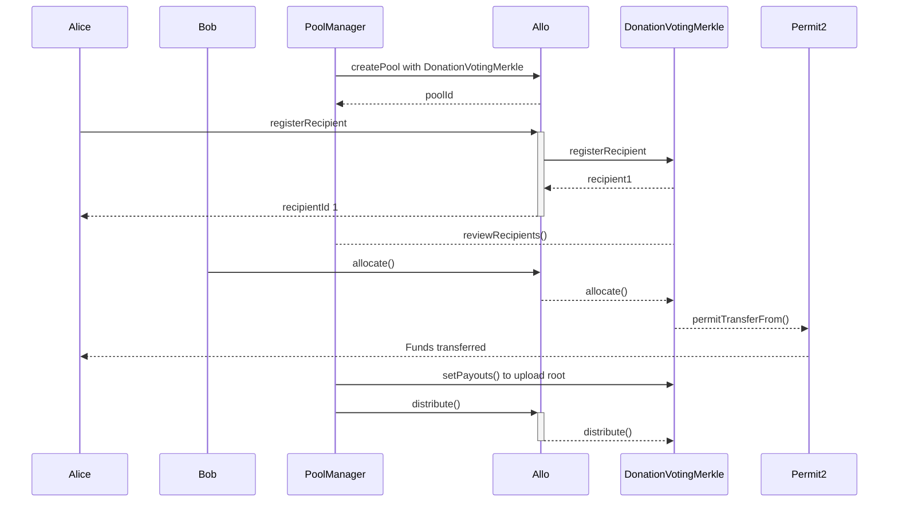

# DonationVotingMerkleDistributionDirectTransferStrategy.sol

The `DonationVotingMerkleDistributionDirectTransferStrategy` contract presents an advanced fund distribution approach within the Allo ecosystem, combining Merkle trees, recipient statuses, and precise timestamps for secure and equitable allocation. This contract builds upon the `BaseStrategy` while integrating OpenZeppelin's `ReentrancyGuard` and `Multicall` libraries, ensuring heightened security, prevention of reentrancy attacks, and optimized batch operations.

## Table of Contents
- [DonationVotingMerkleDistributionDirectTransferStrategy.sol](#donationvotingmerkledistributiondirecttransferstrategysol)
  - [Table of Contents](#table-of-contents)
  - [Sequence Diagram](#sequence-diagram)
  - [Smart Contract Overview](#smart-contract-overview)
    - [Structs and Enums](#structs-and-enums)
    - [Modifiers](#modifiers)
    - [Constructor](#constructor)
    - [Views and Queries](#views-and-queries)
    - [External/Custom Functions](#externalcustom-functions)
    - [Internal Functions](#internal-functions)
    - [Recipient Status Bitmap](#recipient-status-bitmap)
    - [Merkle Tree Distribution](#merkle-tree-distribution)
  - [User Flows](#user-flows)
    - [Registering a Recipient](#registering-a-recipient)
    - [Reviewing Recipients](#reviewing-recipients)
    - [Updating Pool Timestamps](#updating-pool-timestamps)
    - [Withdrawing Funds from Pool](#withdrawing-funds-from-pool)
    - [Updating Distribution](#updating-distribution)
    - [Distributing Funds](#distributing-funds)
    - [Checking Distribution Status](#checking-distribution-status)
    - [Checking Distribution Set Status](#checking-distribution-set-status)
    - [Checking Recipient Status](#checking-recipient-status)
    - [Getting Recipient Details](#getting-recipient-details)
    - [Getting Payout Summary](#getting-payout-summary)
    - [Receiving Ether (Fallback Function)](#receiving-ether-fallback-function)

## Sequence Diagram

## Smart Contract Overview

* **License:** The `DonationVotingMerkleDistributionDirectTransferStrategy` contract adheres to the AGPL-3.0-only License, promoting open-source usage with specific terms.
* **Solidity Version:** Developed using Solidity version 0.8.19, leveraging the latest Ethereum smart contract advancements.
* **External Libraries:** Utilizes the `MerkleProof`, `ReentrancyGuard`, `Multicall` libraries from OpenZeppelin for enhanced security, efficiency, and reentrancy protection, `SafeTransferLib` from Solady and `ISignatureTransfer` from Uniswap permit2.
* **Interfaces:** Interfaces with the `IAllo` and `IRegistry` components for external communication.
* **Inheritance:** Inherits from the `BaseStrategy` contract, inheriting and expanding core strategy functionalities.

### Structs and Enums

1. `ApplicationStatus`: Contains the recipient application's index and status row.
2. `Recipient`: Captures recipient-specific attributes, such as using a registry anchor, recipient address, and metadata.
3. `Distribution`: Represents fund distribution, encompassing an index, recipient ID, allocation amount, and Merkle proof.
4. `Permit2Data`: Represents the permit data and the signature.

### Modifiers

* `onlyActiveRegistration`: Restricts actions to the active registration period.
* `onlyActiveAllocation`: Permits actions only during the active allocation phase.
* `onlyAfterAllocation`: Allows actions after the allocation period concludes.

### Constructor

The constructor initializes the strategy with essential parameters and configurations.

### Views and Queries

1. `getRecipient`: Retrieves recipient details using their ID.
2. `isDistributionSet`: Checks if the distribution is configured.
3. `hasBeenDistributed`: Verifies if a distribution has occurred.

### External/Custom Functions

1. `reviewRecipients`: Enables pool managers to update recipient application statuses.
2. `updatePoolTimestamps`: Allows pool managers to adjust pool phase timestamps.
3. `withdraw`: Permits pool managers to withdraw funds post-allocation.
4. `updateDistribution`: Enables pool managers to update distribution metadata and Merkle root.
5. `isDistributionSet`: Checks if the distribution is configured.
6. `getRecipient`: Retrieves recipient details using their ID.

### Internal Functions

1. `_isValidAllocator`: Validates an address as an eligible allocator.
2. `_isPoolTimestampValid`: Validates the pool's timestamp configuration.
3. `_isPoolActive`: Checks if the pool is active.
4. `_registerRecipient`: Registers a recipient with validation and status updates.
5. `_allocate`: Allocates tokens to recipients using provided data.
6. `_distribute`: Distributes funds to recipients based on data.
7. `_isProfileMember`: Checks if the sender is a profile member (when using registry anchors).
8. `_getRecipient`: Retrieves recipient details using their ID.
9. `_getRecipientStatus`: Retrieves a recipient's status (pending, accepted, rejected, appealed).
10. `_getUintRecipientStatus`: Retrieves recipient status as a uint8 value.
11. `_getStatusRowColumn`: Retrieves a recipient's status row index, column index, and current row.
12. `_setRecipientStatus`: Sets a recipient's status.
13. `_setDistributed`: Marks a distribution as complete.
14. `_validateDistribution`: Validates a distribution with a provided Merkle proof.
15. `_hasBeenDistributed`: Checks if a distribution has occurred.

### Recipient Status Bitmap

The contract employs a bitmap to efficiently store recipient statuses. Each bit in the bitmap represents a specific recipient's status (pending, accepted, rejected, appealed). By using 4 bits per recipient, the bitmap optimally accommodates five status levels.

### Merkle Tree Distribution

The contract implements a Merkle tree structure for fund distribution. The Merkle tree is stored in the `distributionMetadata` and the Merkle root is stored in `merkleRoot`. To distribute funds, a pool manager submits the proofs, and the contract verifies it against the Merkle root, ensuring the validity of distributions.

In summary, the `DonationVotingMerkleDistributionDirectTransferStrategy` contract introduces a sophisticated fund distribution mechanism within the Allo ecosystem. By integrating Merkle trees, precise timestamps, and recipient status management, the contract guarantees secure and fair fund allocation. With the integration of external libraries and meticulous contract design, the strategy fosters efficient and secure fund distribution.

## User Flows

### Registering a Recipient

* Recipient initiates a registration request.
* If `useRegistryAnchor` is enabled:
  *  Decodes recipient ID, recipient address, and metadata from provided data.
  * Verifies sender's authorization as a profile member.
  * Validates the provided data.
  * If recipient ID is not a profile member, reverts.
  * Registers recipient as "Pending" with provided details.
  * Emits `Registered` event.
* If `useRegistryAnchor` is disabled:
  * Decodes recipient address, registry anchor (optional), and metadata from provided data.
  * Determines if registry anchor is being used.
  * Verifies sender's authorization as a profile member if using registry anchor.
  * Validates the provided data.
  * If registry anchor is used and recipient ID is not a profile member, reverts.
  * Registers recipient as "Pending" with provided details.
  * Emits `Registered` event.

### Reviewing Recipients

* Pool Manager initiates a recipient status review request.
* Verifies if sender is a pool manager.
* Loops through provided application statuses and
  * Updates recipient's status based on the application status.
  * Emits `RecipientStatusUpdated` event.

### Updating Pool Timestamps

* Pool Manager initiates a pool timestamp update request.
* Verifies if sender is a pool manager.
* Updates registration and allocation timestamps.
* Emits `TimestampsUpdated` event.

### Withdrawing Funds from Pool

* Pool Manager initiates a withdrawal request.
* Verifies if sender is a pool manager.
* Deducts the specified amount from the pool amount.
* Transfers the specified amount to the sender's address.

### Updating Distribution

* Pool Manager initiates a distribution update request.
* Verifies if sender is a pool manager.
* Checks if distribution has started, reverts if it has.
* Updates merkle root and distribution metadata.
* Emits `DistributionUpdated` event.

### Distributing Funds

* Pool Manager initiates a batch payout request.
* Verifies if sender is a pool manager.
* Checks if distribution has started.
* Decodes distribution data and loops through distributions and
  * Validates the distribution using merkle proof.
  * Deducts the distributed amount from the pool amount.
  * Transfers the distributed amount to the recipient's address.
  * Marks the distribution as done. e. Emits `FundsDistributed` event.

### Checking Distribution Status

* User initiates a distribution status check request.
* Checks if the specified distribution index has been marked as distributed.

### Checking Distribution Set Status

* User initiates a distribution set status check request.
* Checks if the merkle root for distribution has been set.

### Checking Recipient Status

* User initiates a recipient status check request.
* Retrieves and returns the recipient status.

### Getting Recipient Details

* User initiates a recipient details request.
* Retrieves and returns recipient details, including recipient address and metadata.

### Getting Payout Summary

 * Pool Manager initiates a payout summary request.
 * Decodes distribution data and retrieves recipient address and payout amount for a distribution.

### Receiving Ether (Fallback Function)

* The contract receives Ether from external transactions.
* Ether is added to the contract's balance.
