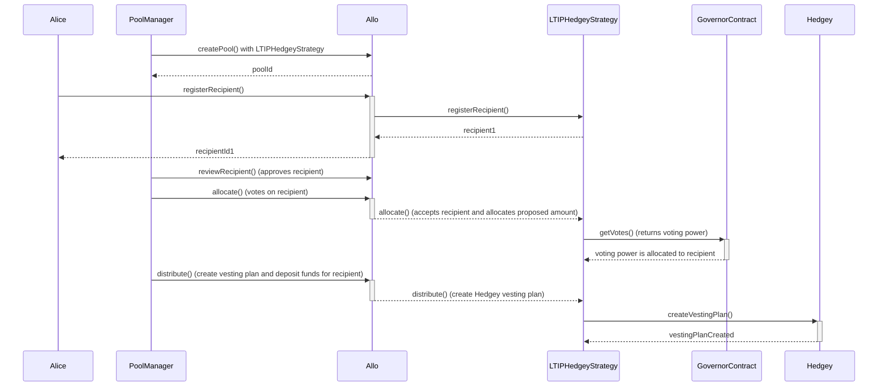

# LTIPHedgeyGovernorStrategy.sol

The `LTIPHedgeyGovernorStrategy` contract represents a smart contract for Long-Term Incentive Programs (LTIP). It extends the capabilities of the `LTIPHedgeyStrategy` contract and replaced the voting mechanism with weighted voting based on -delegated- voting balances.

## Table of Contents

- [LTIPHedgeyGovernorStrategy.sol](#ltiphedgeygovernorstrategysol)
  - [Table of Contents](#table-of-contents)
  - [Sequence Diagram](#sequence-diagram)
  - [Smart Contract Overview](#smart-contract-overview)
    - [Structs](#structs)
    - [Errors](#errors)
    - [Events](#events)
    - [Storage Variables](#storage-variables)
    - [Constructor](#constructor)
    - [Initialize Function](#initialize-function)
    - [Views](#views)
    - [External Functions](#external-functions)
    - [Internal Functions](#internal-functions)
  - [User Flows](#user-flows)
    - [Registering a Recipient](#registering-a-recipient)
    - [Setting Milestones](#setting-milestones)
    - [Submitting a Milestone Proof](#submitting-a-milestone-proof)
    - [Rejecting a Pending Milestone](#rejecting-a-pending-milestone)
    - [Updating Max Bid](#updating-max-bid)
    - [Distributing Milestone](#distributing-milestone)
    - [Withdrawing Funds from Pool](#withdrawing-funds-from-pool)

## Sequence Diagram

## Smart Contract Overview

- **License:** The `LTIPHedgeyGovernorStrategy` contract operates under the AGPL-3.0-only License, fostering open-source usage under specific terms.
- **Solidity Version:** Developed using Solidity version 0.8.19, capitalizing on the latest Ethereum smart contract functionalities.
- **External Libraries:** Utilizes the `ReentrancyGuard` library from the OpenZeppelin contracts to prevent reentrant attacks.
- **Interfaces:** Imports interfaces from the Allo core and external libraries.
- **Internal Libraries:** Imports the `Metadata` library from the Allo core for metadata management.

### Structs

1. `InitializeParamsGovernor`: Initializes the strategy with specific parameters for the governor contract and nested parameters for the underlying strategies.

### Errors

1. `VOTING_WEIGHT_ZERO`: Thrown when a voter has no voting weight - i.e. no -delegated- tokens.
2. `VOTING_EXCEEDS_WEIGHT`: Thrown when a voter will exceed their voting weight.

### Events

1. `VotingBlockUpdated`: Emitted when block to check voting weight against is updated.
2. `VotesRevoked`: Emitted when votes are revoked.

### Storage Variables

1. `governorContract`: The address of the governor contract to get voting power from
2. `votingBlock`: The block number to get voting balances from the Governor contract
3. `votesCasted`: Tracks the total number of votes casted by an address
4. `votesCasterFor`: Maps the total number of votes casted by an address for a specific recipient

### Constructor

The constructor initializes the strategy by accepting the address of the `IAllo` contract and a name.

### Initialize Function

The `initialize` function decodes and initializes parameters passed during strategy creation. It sets specific strategy variables and the pool to active.

### Views

See the `Views` section in the `LTIPSimpleStrategy` contract.

### External Functions

1. `setVotingBlock`: Update the block number to get voting balances from the Governor contract
2. `revokeVotes`: Revokes allocated votes from a recipient

### Internal Functions

1. `_allocate`: Allocate (delegated) voting power to a recipient. 
2. `_isValidAllocator`: Check if the allocator has enough voting power to allocate to a recipient.

## User Flows

### Weighted voting 

- A delegate can vote on behalf of a voter as managed in the Governor contract.
- The delegate can vote on behalf of multiple voters by aggregating balances.
- The delegate casts votes on a recipient based on the aggregated balance.
- The contract checks alread allocated balances and throws an error if the delegate exceeds the allocated balance.

