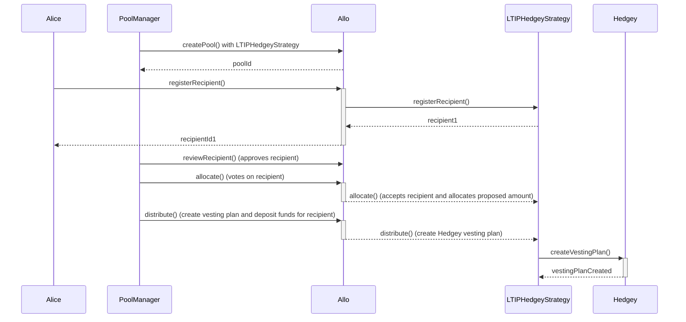

# LTIPHedgeyStrategy.sol

The `LTIPHedgeyStrategy` contract represents a smart contract for Long-Term Incentive Programs (LTIP). It extends the capabilities of the `LTIPSimpleStrategy` contract and replaced the TokenTimeLock vesting with [Hedgey](https://hedgey.gitbook.io/hedgey-community-docs/hedgey/vesting-plans) vesting. The contract also incorporates the `ReentrancyGuard` library to prevent reentrant attacks.

## Table of Contents

- [LTIPHedgeyStrategy.sol](#ltiphedgeystrategysol)
  - [Table of Contents](#table-of-contents)
  - [Sequence Diagram](#sequence-diagram)
  - [Smart Contract Overview](#smart-contract-overview)
    - [Structs](#structs)
    - [Errors](#errors)
    - [Events](#events)
    - [Storage Variables](#storage-variables)
    - [Constructor](#constructor)
    - [Initialize Function](#initialize-function)
    - [Views](#views)
    - [External Functions](#external-functions)
    - [Internal Functions](#internal-functions)
  - [User Flows](#user-flows)
    - [Registering a Recipient](#registering-a-recipient)
    - [Setting Milestones](#setting-milestones)
    - [Submitting a Milestone Proof](#submitting-a-milestone-proof)
    - [Rejecting a Pending Milestone](#rejecting-a-pending-milestone)
    - [Updating Max Bid](#updating-max-bid)
    - [Distributing Milestone](#distributing-milestone)
    - [Withdrawing Funds from Pool](#withdrawing-funds-from-pool)

## Sequence Diagram

## Smart Contract Overview

- **License:** The `LTIPHedgeyStrategy` contract operates under the AGPL-3.0-only License, fostering open-source usage under specific terms.
- **Solidity Version:** Developed using Solidity version 0.8.19, capitalizing on the latest Ethereum smart contract functionalities.
- **External Libraries:** Utilizes the `ReentrancyGuard` library from the OpenZeppelin contracts to prevent reentrant attacks.
- **Interfaces:** Imports interfaces from the Allo core and external libraries.
- **Internal Libraries:** Imports the `Metadata` library from the Allo core for metadata management.

### Structs

1. `InitializeParamsHedgey`: Contains parameters for initializing the strategy.

### Errors

See the `Errors` section in the `LTIPSimpleStrategy` contract.

### Events

1. `AdminAddressUpdated`: Emitted when the admin address of the Hedgey vesting plan is updated
2. `AdminTransferOBOUpdated`: Emitted when the admin transfer OBO is updated

### Storage Variables

1. `hedgeyContract`: The contract that mints the Hedgey vesting plans
2. `vestingAdmin`: The admin address of the Hedgey vesting plan, this address can revoke created plans
3. `adminTransferOBO`: Toggle to allow the vestingAdmin to transfer a plan and NFT to another wallet on behalf of (OBO) a beneficiary.

### Constructor

The constructor initializes the strategy by accepting the address of the `IAllo` contract and a name.

### Initialize Function

The `initialize` function decodes and initializes parameters passed during strategy creation. It sets specific strategy variables and the pool to active.

### Views

See the `Views` section in the `LTIPSimpleStrategy` contract.

### External Functions

1. `setVestingAdmin`: Update the default admin wallet used when creating Hedgey plans 
2. `setAdminTransferOBO`: Update the default sdmin wallet used when creating Hedgey plans

### Internal Functions

1. `_vestAmount`: Creates and funds a Hedgey vesting plan for a recipient.

## User Flows

### Distributing Vesting

- User initiates a distribution request.
- Verifies if sender is authorized to distribute funds.
- Checks if a recipient passess voting threshols exists.
- Creates a vesting plan and deposits funds for the recipient into the plan.
- Emits `VestingPlanCreated` and `Distributed` events.
