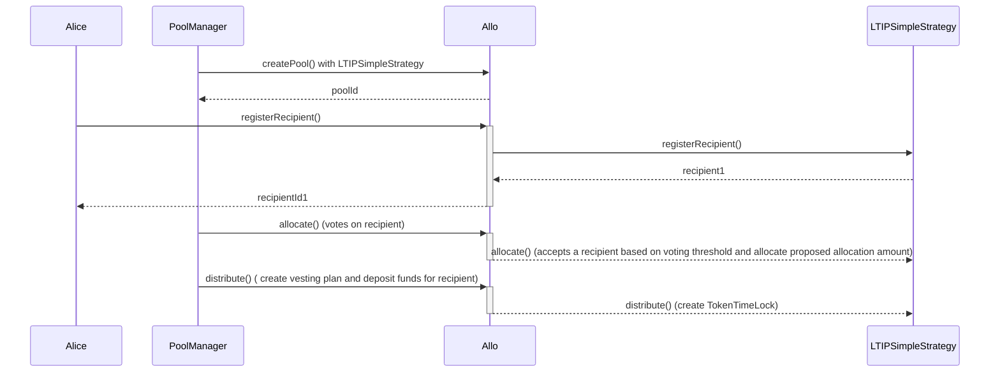

//TODO Update for LTIP Strategy

# LTIPSimpleStrategy.sol

The `LTIPSimpleStrategy` contract represents a smart contract for Long-Term Incentive Programs (LTIP). It extends the capabilities of the `BaseStrategy` contract and integrates features specifically tailored for managing applications and distributing funds. The contract also incorporates the `ReentrancyGuard` library to prevent reentrant attacks.

## Table of Contents
- [RFPSimpleStrategy.sol](#rfpsimplestrategysol)
  - [Table of Contents](#table-of-contents)
  - [Sequence Diagram](#sequence-diagram)
  - [Smart Contract Overview](#smart-contract-overview)
    - [Structs](#structs)
    - [Errors](#errors)
    - [Events](#events)
    - [Storage Variables](#storage-variables)
    - [Constructor](#constructor)
    - [Initialize Function](#initialize-function)
    - [Views](#views)
    - [External Functions](#external-functions)
    - [Internal Functions](#internal-functions)
  - [User Flows](#user-flows)
    - [Registering a Recipient](#registering-a-recipient)
    - [Distributing Milestone](#distributing-milestone)
    - [Withdrawing Funds from Pool](#withdrawing-funds-from-pool)

## Sequence Diagram 

## Smart Contract Overview

- **License:** The `LTIPSimpleStrategy` contract operates under the AGPL-3.0-only License, fostering open-source usage under specific terms.
- **Solidity Version:** Developed using Solidity version 0.8.19, capitalizing on the latest Ethereum smart contract functionalities.
- **External Libraries:** Utilizes the `ReentrancyGuard` library from the OpenZeppelin contracts to prevent reentrant attacks.
- **Interfaces:** Imports interfaces from the Allo core and external libraries.
- **Internal Libraries:** Imports the `Metadata` library from the Allo core for metadata management.

### Structs

1. `Recipient`: Contains recipient-related data, such as the recipient's address, requested allocation amount, use of registry anchor, and status.
2. `VestingPlan`: Points to the vesting plan for the recipient.
3. `InitializeParams`: Contains parameters for initializing the strategy.

### Errors

1. `APPLICATION_CANCELLED`: Thrown when an application has been cancelled. After cancellation, reapplying is blocked.
2. `ALREADY_ALLOCATED`: Thrown when recipients already have received a funds allocation.

### Events

1. `UpdatedRegistration`: Emitted when a recipient updates their registration.
2. `AllocationRevoked`: Emitted when allocated funds are revoked and returned to the pool.
3. `Voted`: Emitted when a vote is cast.
4. `VestingPlanCreated`: Emitted when a vesting plan is created.
5. `AllocationPeriodExtended` 

### Storage Variables

1. `useRegistryAnchor`: Flag to indicate whether to use the registry anchor or not.
metadataRequired: Flag to indicate whether metadata is required or not.
2. `registryGating`: (No notice provided)
3. `votingThreshold`: The voting threshold for a recipient to be accepted.
4. `registrationStartTime`: Start time for registration.
5. `registrationEndTime`: End time for registration.
6. `reviewStartTime`: Start time for review.
7. `reviewEndTime`: End time for review.
8. `allocationStartTime`: Start time for allocation.
9. `allocationEndTime`: End time for allocation.
10. `distributionStartTime`: Start time for distribution.
11. `distributionEndTime`: End time for distribution.
12. `vestingPeriod`: Vesting period in seconds.
13. `acceptedRecipientId`: The accepted recipient who can submit milestones.
14. `_registry`: The registry contract interface. (Private)
15. `_recipientIds`: Internal collection of recipients. (Private)
16. `_recipients`: This maps accepted recipients to their details. 'recipientId' to 'Recipient'. (Internal)
17. `_vestingPlans`: This maps accepted recipients to their vesting plans. 'recipientId' to 'VestingPlan'. (Internal)

### Constructor

The constructor initializes the strategy by accepting the address of the `IAllo` contract and a name.

### Initialize Function

The `initialize` function decodes and initializes parameters passed during strategy creation. It sets specific strategy variables and the pool to active.

### Views

1. `getRecipient`: Retrieves recipient details.
2. `getVestingPlan`: Retrieves milestone details.
3. `getPayouts`: Returns the payout details for a recipient.

### External Functions

1. `withdraw`: Allows pool managers to withdraw funds from the pool.
2. `setPoolActive`: Sets the pool to active.
3. `extendAllocationEndTime`: Extends the allocation end time.

### Internal Functions

1. `_registerRecipient`: Submit a proposal to receive funds from LTIP pool.
2. `_allocate`: Select recipient for LTIP allocation
3. `_distribute`: Distributes upcoming milestone funds to the accepted recipient.
4. `_transferAmount`: Creates a vesting plan and deposits funds for the recipient into the plan.
5. `_getRecipientStatus`: Retrieves the status of a recipient.
6. `_isProfileMember`: Check is msg.sender is a linked to a profile in the registry.

## User Flows

### Registering a Recipient

* Recipient or Profile Owner initiates a registration request.
* If `useRegistryAnchor` is enabled:
  * Submits recipient ID, proposal bid, and metadata.
  * Verifies sender's authorization.
  * Validates the provided data.
  * Registers recipient as "Pending" with provided details.
  * Emits `Registered` event.
* If `useRegistryAnchor` is disabled:
  * Submits recipient address, registry anchor, proposal bid, and metadata.
  * Determines if the registry anchor is being used.
  * Verifies sender's authorization.
  * Validates the provided data.
  * Registers recipient as "Pending" with provided details.
  * Emits `Registered` event.

### Accepting or rejecting an application
* Recipient of Profile Owner registers on strategy by calling `registerRecipient` function.
  * Emits `Registered` event.
* If all checks are passed, the recipient is registered as "Pending".
* When the review period is active, the PoolManager can vote on the acceptance of the recipient.
  * If the recipient is accepted, the recipient status is set to "Accepted".
  * If the recipient is rejected, the recipient status is set to "Rejected".
* Emits `Reviewed` event.

### Voting on acceptance of a recipient
* Check is a vote has already been cast. 
* All PoolManagers have a voting power of 1
* PoolManager votes on the acceptance of the recipient.
  * Assigns a vote to the recipient.
  * Emits `Voted` event.
* If the vote puts the recipient on the threshold, the recipient is accepted.
  * Recipient status is set to "Accepted".
  * Emits `Allocated` event.

### Allocate funds in a vesting plan
* Check if the recipient doesn't have an active vesting plan
* Check if the recipient status is "Accepted".
* Create a vesting plan for the recipient (a OZ TokenTimeLock contract instance).
  * Transfer the allocated funds to the vesting plan.8
  * Emits `VestingPlanCreated` event.
* Emits `Distributed` event.

### Withdrawing Funds from Pool

* Pool Manager initiates a withdrawal request.
* Verifies if sender is authorized to withdraw funds.
* Checks if the pool is inactive.
* Decreases the pool amount by the requested withdrawal amount.
* Transfers the requested amount to the sender.
