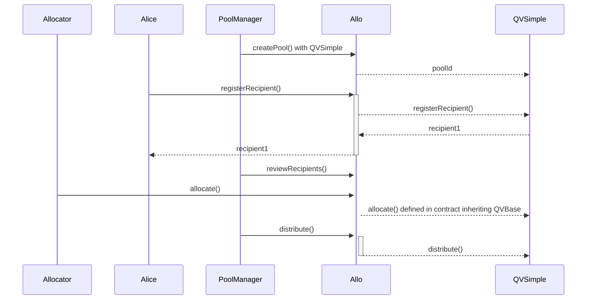

# QVBaseStrategy.sol

The `QVBaseStrategy` is a base contract for quadratic voting strategies.  It extends the `BaseStrategy` contract. It's designed to be a base contract for other contracts to inherit from. It includes functions for recipient registration, allocator allocation, and payout distribution. It also includes a review mechanism for pool managers to review and update the status of recipients. It uses a custom InternalRecipientStatus enum for internal state management. It has a strong focus on modularity and reusability, with many functions marked as virtual.

## Table of Contents
- [QVBaseStrategy.sol](#qvbasestrategysol)
  - [Table of Contents](#table-of-contents)
  - [Sequence Diagram](#sequence-diagram)
  - [Smart Contract Overview](#smart-contract-overview)
  - [Structs and Enums](#structs-and-enums)
    - [Recipient](#recipient)
    - [Allocator](#allocator)
    - [InitializeParams](#initializeparams)
  - [Modifiers](#modifiers)
  - [Constructor](#constructor)
  - [Initialize](#initialize)
  - [Views and Queries](#views-and-queries)
  - [External/Custom Functions](#externalcustom-functions)
  - [Internal Functions](#internal-functions)
  - [User Flows](#user-flows)
    - [Recipient Registration](#recipient-registration)
    - [Allocator Allocation](#allocator-allocation)
    - [Recipient Voting](#recipient-voting)
    - [Payout Distribution](#payout-distribution)
    - [Updating Pool Timestamps](#updating-pool-timestamps)
    - [Recipients Review Process](#recipients-review-process)
    - [Querying Recipient and Allocator Information](#querying-recipient-and-allocator-information)
    - [Viewing Pool Timestamps and Status](#viewing-pool-timestamps-and-status)

## Sequence Diagram

## Smart Contract Overview

* **License:** The `QVBaseStrategy` contract adheres to the AGPL-3.0-only License, promoting open-source usage with specific terms.
* **Solidity Version:** Developed using Solidity version 0.8.19, leveraging the latest Ethereum smart contract advancements.
* **Internal Libraries:** Utilizes the `Metadata` library.
* **Interfaces:** Interfaces with the `IAllo` and `IRegistry` components for external communication.
* **Inheritance:** Inherits from the `BaseStrategy` contract, inheriting and expanding core strategy functionalities.

## Structs and Enums

### Recipient

Details of a recipient.

* `totalVotesReceived` (uint256): Total votes received by the recipient
* `useRegistryAnchor` (bool): Whether the recipient uses registry anchor
* `recipientAddress` (address): Address of the recipient
* `recipientStatus` (InternalRecipientStatus): Status of the recipient
* `metadata` (Metadata): Metadata details

### Allocator

Details of an allocator.

* `voiceCredits` (uint256): Total voice credits of the allocator
* `voiceCreditsCastToRecipient` (mapping(address => uint256)): Voice credits cast to recipients by the allocator

### InitializeParams

* `registryGating` (bool, slot 0): Whether the strategy uses registry gating for recipient applications.
* `metadataRequired` (bool, slot 0): Whether metadata is required for recipient applications.
* `reviewThreshold` (uint256, slot 1): The number of votes required to review a recipient.
* `registrationStartTime` (uint64, slot 2): The start time for recipient registration in milliseconds since the epoch.
* `registrationEndTime` (uint64, slot 2): The end time for recipient registration in milliseconds since the epoch.
* `allocationStartTime` (uint64, slot 2): The start time for vote allocation in milliseconds since the epoch.
* `allocationEndTime` (uint64, slot 2): The end time for vote allocation in milliseconds since the epoch.

## Modifiers

* `onlyActiveRegistration`: Allows execution only during the active registration period.
* `onlyActiveAllocation`: Allows execution only during the active allocation period.
* `onlyAfterAllocation`: Allows execution only after the allocation period has ended.

## Constructor
* `constructor(address _allo, string memory _name)`: Sets the Allo contract address and the strategy name.

## Initialize

* `initialize(uint256 _poolId, bytes calldata _data) external`: Initializes the strategy with provided parameters.

## Views and Queries

* `getRecipient(address _recipientId) external view returns (Recipient memory)`: Retrieves recipient details using recipient ID.
* `getInternalRecipientStatus(address _recipientId) external view returns (InternalRecipientStatus)`: Retrieves internal recipient status using recipient ID.
* `getRecipientStatus(address _recipientId) external view returns (RecipientStatus)`: Retrieves global recipient status using recipient ID.

## External/Custom Functions

* `updatePoolTimestamps(uint64 _registrationStartTime, uint64 _registrationEndTime, uint64 _allocationStartTime, uint64 _allocationEndTime) external`: Updates the start and end timestamps for the pool.
* `reviewRecipients(address[] calldata _recipientIds, InternalRecipientStatus[] calldata _recipientStatuses) external`: Reviews recipient applications during the active registration.
* `distribute(address[] calldata _recipientIds) external`: Distributes tokens to recipients after allocation.

## Internal Functions

* `_distribute(address[] storage _recipientIds, address _sender) internal`: Distributes tokens to recipients after allocation.
* `_isPoolActive() internal view returns (bool)`: Checks if the pool is currently active.
* `_getPayout(address _recipientId) internal view returns (PayoutSummary memory)`: Calculates the payout for a recipient.
* `_qv_allocate(Allocator storage _allocator, Recipient storage _recipient, address _recipientId, uint256 _voiceCreditsToAllocate, address _sender) internal`: Allocates voice credits to a recipient.
* `_isValidAllocator(address _allocator) internal view returns (bool)`: Checks if an allocator is valid.
* `_hasVoiceCreditsLeft(uint256 _voiceCreditsToAllocate, uint256 _allocatedVoiceCredits) internal pure returns (bool)`: Checks if an allocator has voice credits left.
* `_isAcceptedRecipient(address _recipientId) internal view returns (bool)`: Checks if a recipient is accepted.
* `_isProfileMember(address _anchor, address _sender) internal view returns (bool)`: Checks if a sender is a profile member.
* `_getRecipient(address _recipientId) internal view returns (Recipient storage)`: Retrieves recipient details using recipient ID.
* `_updatePoolTimestamps(uint64 _registrationStartTime, uint64 _registrationEndTime, uint64 _allocationStartTime, uint64 _allocationEndTime) internal`: Updates the start and end timestamps for the pool.
* `_sqrt(uint256 x) internal pure returns (uint256 y)`: Calculates the square root of a number using the Babylonian method.

## User Flows

### Recipient Registration
    
    * Recipients can submit their application to the pool strategy for registration.
    * Recipients provide necessary data based on the strategy's requirements.
    * The strategy checks if metadata is required and whether the recipient address is valid.
    * Recipients can be accepted, rejected, or appealed based on the review process.
    * If accepted, their status is updated and they are eligible for receiving votes.
### Allocator Allocation
    
    * Allocators (participants) allocate voice credits to specific recipients during the active allocation period.
    * Voice credits are allocated based on a quadratic voting algorithm.
    * Voice credits are cast to recipients, contributing to their total votes received.
    * Allocated voice credits cannot exceed available voice credits for the allocator.
### Recipient Voting
    
    * Recipients can receive voice credits based on the votes allocated to them by allocators.
    * Recipients accumulate votes throughout the active allocation period.
    * Total recipient votes are calculated as the sum of square roots of allocated voice credits.
    * Accumulated votes contribute to determining recipients' payouts.
### Payout Distribution
    
    * After the allocation period ends, the strategy manager initiates the payout distribution.
    * Payouts are distributed to recipients based on their accumulated votes and the total votes in the pool.
    * The calculated payout amount is transferred to recipients' addresses.
    * Once a recipient is paid out, their payout status is updated to prevent double payouts.
 ### Updating Pool Timestamps
    
    * The pool manager can update registration and allocation start and end times.
    * These timestamps determine the active registration and allocation periods.
    * The new timestamps are validated to ensure logical ordering and consistency.
### Recipients Review Process
    
    * Pool managers can review recipient applications and update their statuses.
    * Depending on the review threshold, recipients' statuses can change from pending to accepted or rejected.
    * If the review threshold is met, recipient statuses are updated, allowing them to participate in voting or receive payouts.
### Querying Recipient and Allocator Information
    
    * Users can query the status and details of recipients and allocators using their IDs or addresses.
    * Recipient status, total votes received, and other relevant data can be retrieved.
    * Allocator information such as voice credits allocated to recipients can be queried.

### Viewing Pool Timestamps and Status
    
    * Users can view the start and end times of the registration and allocation periods.
    * The strategy checks the current time against these timestamps to determine active periods.
    * The pool's active status changes based on whether the current time is within the registration or allocation period.
