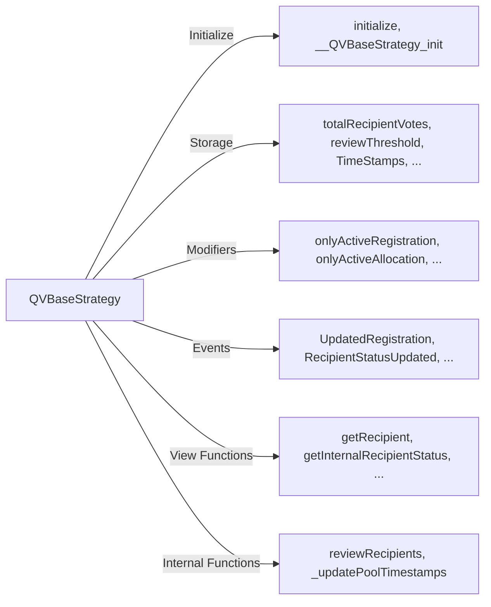

Spec: QV Base Strategy
---------------------------------

## Overview

The QV Base Strategy is a base contract for quadratic voting strategies. It's designed to be a base contract for other contracts to inherit from. It includes functions for recipient registration, allocator allocation, and payout distribution. It also includes a review mechanism for pool managers to review and update the status of recipients. It has a strong focus on modularity and reusability, with many functions marked as virtual.

## Spec

### Events:
The contract emits various events to log important state changes, such as recipient registration updates, vote allocations, and reviews.

### Storage Variables:

`totalRecipientVotes`  is the total votes for all recipients.

`reviewThreshold` The votes required to review a recipient. This is determined by the pool admin upon contract initialization.

`registrationStartTime`, `registrationEndTime`, `allocationStartTime`, `allocationEndTime` are the timeframes for different phases.

`registryGating` & `metadataRequired` are flags for additional features.

`recipients` & `allocators` are mappings to store recipient and allocator details.

### Modifiers:
Custom modifiers like `onlyActiveRegistration`, `onlyActiveAllocation`, and `onlyAfterAllocation` are used to restrict function calls based on the contract's state.

### Initialization:
The contract has an `initialize` function.

### Review Mechanism:
The contract includes a `reviewRecipients` function, allowing a pool manager to review and update the status of recipients.

### Timestamp Updates:
The contract allows updating the start and end times for registration and allocation phases.

## Diagram

## Implementation

This contract is implemented in [QVSimple.sol](../qv-simple/QVSimpleStrategy.sol) as a simple quadratic voting strategy example. It is also implemented in [HackathonQVStrategy.sol](../qv-hackathon/HackathonQVStrategy.sol) as a quadratic voting strategy for hackathons.

## Testing
TODO: Add test specs for building on this.