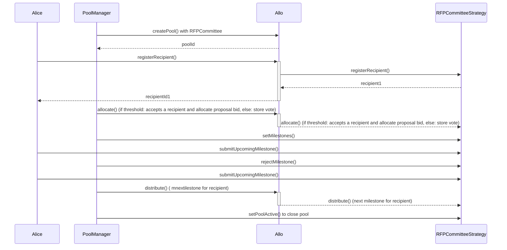

# RFPCommitteeStrategy.sol

The `RFPCommitteeStrategy` contract extends the functionality of the `RFPSimpleStrategy` contract to implement a strategy where a committee of members vote to select a recipient for RFP allocation. This contract enhances the base strategy by introducing a voting mechanism and threshold to determine the accepted recipient.

## Table of Contents
- [RFPCommitteeStrategy.sol](#rfpcommitteestrategysol)
  - [Table of Contents](#table-of-contents)
  - [Sequence Diagram](#sequence-diagram)
  - [Smart Contract Overview](#smart-contract-overview)
    - [Events](#events)
    - [Storage Variables](#storage-variables)
    - [Constructor](#constructor)
    - [Initialize Function](#initialize-function)
    - [Internal Functions](#internal-functions)
  - [User Flows](#user-flows)
    - [Committee Member Allocation](#committee-member-allocation)
  - [Internal Utility Functions](#internal-utility-functions)
    - [Allocate Function Override](#allocate-function-override)

## Sequence Diagram 

## Smart Contract Overview

- **License:** The `RFPCommitteeStrategy` contract operates under the AGPL-3.0-only License.
- **Solidity Version:** Developed using Solidity version 0.8.19.
- **Inheritance:** Inherits functionality from the `RFPSimpleStrategy` contract.
- **Events:** Introduces an additional event `Voted` to signal committee member votes.
- **Storage Variables:** Adds new storage variables for voting and threshold management.

### Events

1. `Voted`: Emitted when a committee member casts a vote for a recipient.

### Storage Variables

1. `voteThreshold`: The minimum number of votes required for a recipient to be accepted.
2. `votedFor`: Maps committee member addresses to the recipient they voted for.
3. `votes`: Maps recipient addresses to the number of votes received.

### Constructor

The constructor initializes the strategy by accepting the address of the `IAllo` contract and a name. It then invokes the constructor of the `RFPCommitteeStrategy` contract.

### Initialize Function

The `initialize` function decodes and initializes parameters passed during strategy creation. It sets specific strategy variables and initializes the vote threshold.

### Internal Functions

The `_allocate` function is overridden to incorporate the committee voting mechanism. It verifies whether the sender has already voted, registers the vote, and if the vote threshold is reached, accepts the recipient. The function then updates the recipient's status, deactivates the pool, and emits relevant events.

## User Flows

### Committee Member Allocation

* Committee member initiates an allocation.
* Verifies if sender is authorized to allocate.
* Checks if an accepted recipient is already selected.
* Retrieves the recipient ID to allocate for.
* Removes the old vote if applicable.
* Casts a vote for the recipient and updates the votes mapping.
* If the vote threshold is reached:
  * Marks the recipient as accepted.
  * Deactivates the pool.
  * Emits `Allocated` event.

## Internal Utility Functions

### Allocate Function Override

Overrides the `_allocate` function from the parent contract to incorporate the committee voting mechanism.
