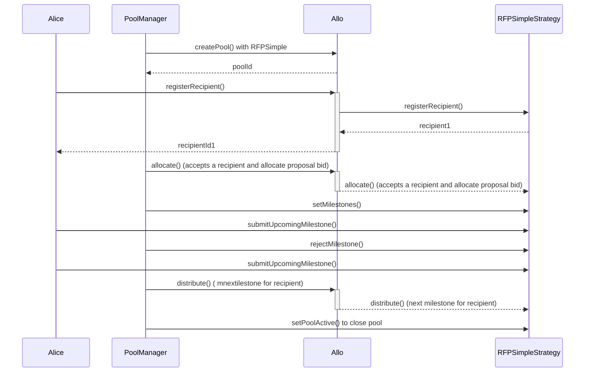

# RFPSimpleStrategy.sol

The `RFPSimpleStrategy` contract represents a smart contract for Request for Proposal (RFP) allocation with milestone submission and management. It extends the capabilities of the `BaseStrategy` contract and integrates features specifically tailored for managing recipient registration, milestone submissions, and reviews for RFPs. The contract also incorporates the `ReentrancyGuard` library to prevent reentrant attacks.

## Table of Contents
- [RFPSimpleStrategy.sol](#rfpsimplestrategysol)
  - [Table of Contents](#table-of-contents)
  - [Sequence Diagram](#sequence-diagram)
  - [Smart Contract Overview](#smart-contract-overview)
    - [Structs](#structs)
    - [Errors](#errors)
    - [Events](#events)
    - [Storage Variables](#storage-variables)
    - [Constructor](#constructor)
    - [Initialize Function](#initialize-function)
    - [Views](#views)
    - [External Functions](#external-functions)
    - [Internal Functions](#internal-functions)
  - [User Flows](#user-flows)
    - [Registering a Recipient](#registering-a-recipient)
    - [Setting Milestones](#setting-milestones)
    - [Submitting a Milestone Proof](#submitting-a-milestone-proof)
    - [Rejecting a Pending Milestone](#rejecting-a-pending-milestone)
    - [Updating Max Bid](#updating-max-bid)
    - [Distributing Milestone](#distributing-milestone)
    - [Withdrawing Funds from Pool](#withdrawing-funds-from-pool)

## Sequence Diagram 

## Smart Contract Overview

- **License:** The `RFPSimpleStrategy` contract operates under the AGPL-3.0-only License, fostering open-source usage under specific terms.
- **Solidity Version:** Developed using Solidity version 0.8.19, capitalizing on the latest Ethereum smart contract functionalities.
- **External Libraries:** Utilizes the `ReentrancyGuard` library from the OpenZeppelin contracts to prevent reentrant attacks.
- **Interfaces:** Imports interfaces from the Allo core and external libraries.
- **Internal Libraries:** Imports the `Metadata` library from the Allo core for metadata management.

### Structs

1. `Recipient`: Contains recipient-related data, such as the recipient's address, proposal bid, use of registry anchor, and status.
2. `Milestone`: Holds details about a milestone, including the amount percentage, metadata, and status.

### Errors

1. `INVALID_MILESTONE`: Thrown when a milestone is invalid.
2. `MILESTONE_ALREADY_ACCEPTED`: Thrown when a milestone is already accepted.
3. `EXCEEDING_MAX_BID`: Thrown when a proposal bid exceeds the maximum bid.
4. `MILESTONES_ALREADY_SET`: Thrown when milestones are already set or approved.
5. `AMOUNT_TOO_LOW`: Thrown when the max bid increase amount is too low.

### Events

1. `MaxBidIncreased`: Emitted when the maximum bid is increased.
2. `MilestoneSubmitted`: Emitted when a milestone is submitted.
3. `MilestoneStatusChanged`: Emitted for the status change of a milestone.
4. `MilestonesSet`: Emitted when milestones are set.

### Storage Variables

1. `useRegistryAnchor`: Flag indicating whether to use the registry anchor for recipient registration.
2. `metadataRequired`: Flag indicating whether metadata is required for recipient registration.
3. `acceptedRecipientId`: The accepted recipient who can submit milestones.
4. `_registry`: Reference to the Allo registry contract.
5. `maxBid`: The maximum bid for the RFP pool.
6. `upcomingMilestone`: Index of the upcoming milestone.
7. `_recipientIds`: Collection of recipient addresses.
8. `milestones`: Collection of submitted milestones.
9. `_recipients`: Mapping from recipient addresses to recipient data.

### Constructor

The constructor initializes the strategy by accepting the address of the `IAllo` contract and a name.

### Initialize Function

The `initialize` function decodes and initializes parameters passed during strategy creation. It sets specific strategy variables and the pool to active.

### Views

1. `getRecipient`: Retrieves recipient details.
2. `getMilestone`: Retrieves milestone details.
3. `getMilestoneStatus`: Retrieves the status of a milestone.

### External Functions

1. `setMilestones`: Sets milestones for the accepted recipient.
2. `submitUpcomingMilestone`: Submits a milestone for the accepted recipient.
3. `rejectMilestone`: Rejects a pending milestone.
4. `increaseMaxBid`: Updates the maximum bid for the RFP pool.
5. `withdraw`: Allows pool managers to withdraw funds from the pool.

### Internal Functions

1. `_registerRecipient`: Handles recipient registration, processing the provided data.
2. `_allocate`: Allocates funds to the accepted recipient.
3. `_distribute`: Distributes upcoming milestone funds to the accepted recipient.

## User Flows

### Registering a Recipient

* Recipient or Profile Owner initiates a registration request.
* If `useRegistryAnchor` is enabled:
  * Submits recipient ID, proposal bid, and metadata.
  * Verifies sender's authorization.
  * Validates the provided data.
  * Registers recipient as "Pending" with provided details.
  * Emits `Registered` event.
* If `useRegistryAnchor` is disabled:
  * Submits recipient address, registry anchor, proposal bid, and metadata.
  * Determines if the registry anchor is being used.
  * Verifies sender's authorization.
  * Validates the provided data.
  * Registers recipient as "Pending" with provided details.
  * Emits `Registered` event.

### Setting Milestones

* Pool Manager initiates a milestone setting request.
* Verifies if sender is authorized to set milestones.
* Checks if upcoming milestone is not already set.
* Sets provided milestones for the accepted recipient.
* Emits `MilestonesSet` event.

### Submitting a Milestone Proof

* Recipient initiates a milestone proof submission.
* Verifies if sender is authorized to submit the proof.
* Checks if upcoming milestone is valid.
* Updates milestone's metadata and status to "Pending".
* Emits `MilestoneSubmitted` event.

### Rejecting a Pending Milestone

* Pool Manager initiates a milestone rejection request.
* Verifies if sender is authorized to reject milestones.
* Checks if milestone is not already accepted.
* Changes milestone status to "Rejected".
* Emits `MilestoneStatusChanged` event.

### Updating Max Bid

* Pool Manager initiates a max bid update request.
* Verifies if sender is authorized to update the max bid.
* Ensures the new max bid is higher than the current max bid.
* Updates the max bid.
* Emits `MaxBidIncreased` event.

### Distributing Milestone

* Pool Manager initiates a milestone distribution request.
* Verifies if sender is authorized to distribute funds.
* Checks if a pending milestone exists.
* Calculates the amount to distribute based on the accepted recipient's proposal bid and milestone percentage.
* Transfers the calculated amount to the accepted recipient.
* Changes the milestone status to "Accepted".
* Emits `MilestoneStatusChanged` and `Distributed` events.

### Withdrawing Funds from Pool

* Pool Manager initiates a withdrawal request.
* Verifies if sender is authorized to withdraw funds.
* Checks if the pool is inactive.
* Decreases the pool amount by the requested withdrawal amount.
* Transfers the requested amount to the sender.
