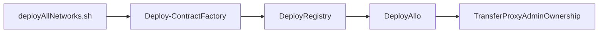

### Networks Supported

The project has been configured to support the following networks.
All the deploy scripts will expect network param to know which network the contract deployment / interaction should take place

#### Main Networks

| network            | chain id | network name |
|--------------------|--|--------------------|
| `mainnet`     | `1`  | Ethereum Mainnet    |
| `pgn`    | `424`  | Public Goods Network    |
| `optimism` | `10` | Optimism |
| `arbitrum`   | `42161` | Arbitrum One   |
| `celo`   | `42220` | Celo   |
| `zksync-era`  | `324` | zkSync Era  |
| `base`    | `84531`  | Base  |
| `polygon`    | `137`  | Polygon PoS  |

#### Test Networks

| network            | chain id | network name       |
|--------------------|--|--------------------|
| `goerli`          | `5`  | Goerli PoW Testnet |
| `sepolia`          | `11155111`  | Sepolia PoS Testnet |
| `base-testnet`          | `84531`  | Base Testnet  |
| `polygon-mumbai`          | `80001`  | Polygon Mumbai Testnet |
| `zksync-testnet`         | `280`  | zkSync Testnet  |
| `arbitrum-goerli` | `421613` | Arbitrum Goerli Testnet |
| `celo-alfajores`   | `44787` | Celo Alfajores Testnet   |
| `optimism-goerli`   | `420` | Optimism Goerli Testnet  |
| `pgn-testnet`   | `58008` |    |

### Setup && Install Dependencies

1. Create an `.env` file and populate the .env file
```sh
cp ../.env.sample ../.env
```

2. Install dependencies
```shell
bun install
```

3. Install Foundry [Install Docs](https://book.getfoundry.sh/getting-started/installation)
   🤚 Only do this if you don't have it installed already, by running the `bun compile`
   command, it will update libs for you.
```shell
foundryup
```

1. Compile Contracts
```shell
bun compile
```

1. Running Tests

The tests have been written in foundry.
For detailed information on how the testing framework works, refer [Test Options](https://book.getfoundry.sh/reference/forge/forge-test#test-options)

Run all tests without verbosity
```bash
bun test
bun test -vvvv # with verbosity
bun test -vvvv --match-test <test_name> # specific test
bun test -vvvv --match-contract <contract_name> # specific contract
# the two above can be used together to dial into a specific test
```

7. Coverage

```bash
buncoverage # generate coverage on terminal
buncoverage:html # generate lcov coverage on html
```

### Deploying Core Contracts across all networks



- Ensure the configuration has been set in 
   - `allo.config.ts`
   - `registry.config.ts`
   - `common.config.ts`
- Check `./scripts/core/deployAllNetworks.sh` and ensure the networks you need to deploy on are uncommented
- Run `./scripts/core/deployAllNetworks.sh`
- This should deploy and generate the log for the deployments for 
   - ContractFactory
   - Registry
   - Allo
   - and update the AlloProxyAdmin 


### Upgrading Core Contracts across all networks

- Ensure the patch fix has been made
- Check `./scripts/core/upgradeAllNetworks.sh` and ensure the networks you need to deploy on are uncommented
- Run `./scripts/core/upgradeAllNetworks.sh allo` to upgrade Allo contracts
- Run `./scripts/core/upgradeAllNetworks.sh registry` to upgrade Registry contracts